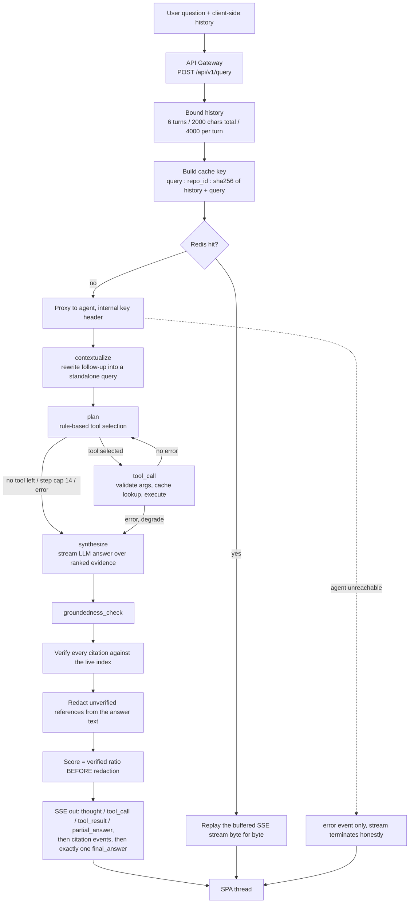
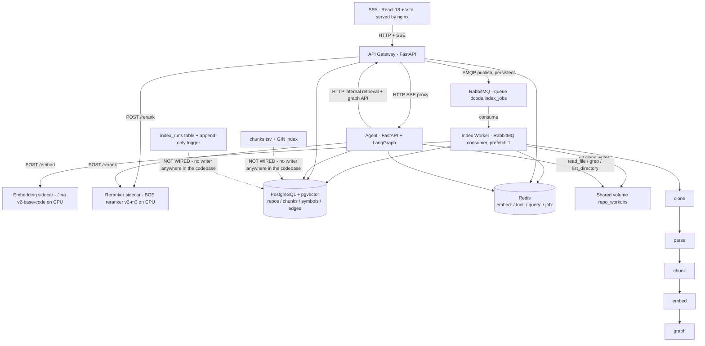

# Dcode —— 一个能查证自己答案的代码理解系统

## 如果只读五句话

1. 这个系统给需要快速读懂一个陌生 Python 仓库的开发者用。
2. 你提交一个 Git 地址，它把代码切块存进数据库，之后你能用自然语言提问。
3. 我搭了整条链路：索引流水线、混合检索、回答问题的 agent，以及前端界面。
4. 我另外做了一套离线评测：判定标准提前写死，另加一组对照实验分清哪个部件起了作用。
5. 结果是我的主假设没通过，而且我最初主打的那个功能，作用比预期小。

---

## 关于这份文档

这是 `docs/interview/` 下的第三份材料，写给帮我改简历的 mentor 看。

| 文件 | 用途 |
|---|---|
| `DCODE_TECH_BRIEF.md` | 全量技术底稿。§4 是可引用数字台账，每个数字标了来源等级 A/B/C/D，并写明引用它时必须一起说的那句话。§4.9 列出不能引用的数字。附录 A 是 25 条文档漂移清单 |
| `DCODE_AGENT_ROLE_PREP.md` | 面试稿，按招聘方考察的能力维度组织 |
| **本文** | 简历素材 |

正文里的数字全部来自底稿 §4 台账。台账给某个数字附了限定语的，本文要么带上那句限定语，要么换一个不需要限定的说法。本文新增的数字放在**附录 A**，同样标来源等级。底稿和 README 说法冲突时以代码为准。

### 项目类型：后端基础设施 + LLM 应用，两边都占，以 agent 侧为主

判断依据是两套东西都真的写了，没有硬凑：

| 后端基础设施 | LLM / agent |
|---|---|
| RabbitMQ 消费者，驱动一个严格单调的六态索引状态机 | LangGraph 五节点 agent 状态机 |
| PostgreSQL + pgvector 四张运行时表，带 HNSW 和反向边索引 | 11 个工具，参数用 Pydantic schema 定义，经注册表调度 |
| Redis 四个键空间，各有各的 TTL | 引用 ID 由服务端下发，未通过验证的引用会被删掉 |
| SSE 网关：截断历史、算缓存键、命中时逐字节重放 | 五级 baseline 离线评测，判定标准预注册，另有对照实验臂 |
| 提交幂等、SSRF 白名单、内部密钥、Alembic 迁移 | 混合检索：BM25 + pgvector + 加权 RRF + cross-encoder 重排 |

主线放在 agent 侧。后端那一半写出来，是为了让 agent 的每一步都能复现、能缓存、能查证。

这个项目没有训练、没有 loss、没有 RL、没有微调，模型全是现成调用。静态调用图解析有算法含量，但它属于程序分析（static program analysis），跟机器学习不是一回事。全文都会把这条边界标清楚。

---

## 项目描述

Dcode 帮开发者读懂一个陌生的 Python 仓库。

你提交一个 Git 地址。worker 把仓库克隆下来，按函数、方法、类的边界切块。之后算好向量，抽出符号表和调用关系。

你提问的时候，一个 agent 会调用工具去查证，再给出答案。

**答案里的每一条引用，系统在发出去之前都会去数据库查一遍。**查不到的引用会从答案正文里删掉，换成一个占位符。groundedness（引用可信度：答案里的引用有几成能在索引里查到）这个分数按**删除之前**的比例算，所以删除不能把分数变高。

前端也跟着这条规则走。如果一次问答的流断了、从来没收到过终答，界面会把它标成第四种状态。它的草稿降级显示，引用不给点击。因为「没检查过」和「检查了没通过」是两回事。

围绕这套机制，我做了一套能证伪自己的离线评测。它有五级 baseline 阶梯，判定标准提前写死。另有一组对照实验，专门用来拆解增益来源。

---

## 架构图

两张图。第一张画一次提问在系统里怎么走，第二张画有哪些服务、数据存在哪。

### 1. 查询链路的 agent 控制流



### 2. 服务与数据层



第二张图里有两条虚线。`chunks.tsv` 和它的 GIN 索引建在库里，但全仓库没有任何代码往里写（稀疏检索走的是应用层手写的 BM25）。`index_runs` 表连不可变触发器都写好了，同样没有写入方。我把它们单独画成虚线，免得读图的人以为它们在主数据流上。

---

## 它在 AI 链路里的位置

这一节说清楚：系统吃什么进去、调了哪些模型、吐什么出来。

| 环节 | 内容 |
|---|---|
| **输入** | 离线索引侧吃一个 Git 地址。在线查询侧吃一句自然语言问题，加上客户端带过来的历史轮次 |
| **调用的模型** | `jinaai/jina-embeddings-v2-base-code` 算向量，自托管 HTTP sidecar 跑在 CPU 上。`BAAI/bge-reranker-v2-m3` 做重排，也是自托管 sidecar。`gpt-4o-mini` 写答案，走 OpenAI 流式接口。judge 位置留了抽象类，但**没有接任何模型** |
| **调用的工具** | 11 个：语义检索、找定义、找引用、找调用邻居、找调用路径、模块依赖正向和反向、文件结构、读文件、ripgrep、列目录 |
| **产出** | 一条 SSE 流：先推理轨迹，再流式答案，然后是**只含已验证引用**的引用事件，最后一条终答带 groundedness 分数。前端据此渲染可点击的引用 chip 和源码 inspector |
| **不产出** | 不训练、不微调、不产生模型权重、不产生偏好数据 |

放到更大的图景里看，这套东西是给 agent 用的评测和查证基建。它不产出策略，它产出判断策略好坏的能力。任何团队想用 RL 或偏好优化改进一个 agent，都得先回答两个问题。奖励信号从哪来？涨的那部分怎么确认是真的？这个项目做的就是这两件事的工程侧。

---

## Agent 架构

### a. 编排

agent 是一个五节点的 LangGraph 状态机，工具选择由一张手写规则表决定。

节点定义在 `apps/agent/src/dcode_agent/graph.py:774-778`：

```
START → contextualize → plan ⇄ tool_call → synthesize → groundedness_check → END
```

`plan → tool_call → plan` 是 ReAct 循环。`plan` 和 `tool_call` 都能有条件地跳到 `synthesize`（`graph.py:782-791`）。请求完全无状态，没装 LangGraph 的 checkpointer，历史由客户端每次带上（`graph.py:770-771`）。

**规划器是一张手写规则表，不走 LLM**（`graph.py:798-812`）。这个选择要分三层讲清楚。

**第一层：为什么这么选。** 项目的核心测量是一组对照实验。B3.5 这个臂是 B4 关掉调用图、其余全部不变。这个差值要有意义，前提是两个臂之间除了工具集合以外没有别的差异。而答案生成本身已经够随机了：三次相同配置的运行，某一层的 margin 摆动幅度超过了判定门槛本身（见「面试口径」第 2 条）。规划器要是也用 LLM，差值里就会混进「模型这次碰巧选了哪个工具」，因果归因就站不住。规则表把两个臂的差异锁在一张映射表里（`state.py:32-44`），而且这张表能被单元测试穷举。

**第二层：代价是一个真实的产品缺陷。** 路由靠关键词表（`graph.py:1087-1112` 和 `:1312-1358`）。一个不含关键词的架构问题，会在第一次检索之后直接停下。而且外部看不出两种情况的区别。规划器判断没有下一步，和规划器没看懂问题，在 SSE 流里长得一模一样。

**第三层：要发货我会怎么改。** 主路径换成 LLM function calling。11 个工具的 JSON Schema 已经能通过 `ToolRegistry.manifest()` 导出（`tools/base.py:58-67`），接口层改动很小。规则表退到两个位置：模型给的参数校验不过时兜一次，以及守住几条安全边界。步数上限、arm 级别的工具禁用、同参数不重复调用这三条不交给模型决定。

换完之后要补三件事，对照实验才能继续做。一是把规划调用的 temperature 单独配置。二是跑一次 A/A 实验，只换规划器的随机种子，量出规划方差。三是把工具调用序列记进产物。

### b. LLM 对接

系统只用 OpenAI 的接口写答案，并且强制模型只能引用服务端给它的 ID。

| 项 | 内容 | 位置 |
|---|---|---|
| Provider | OpenAI Chat Completions，`openai` 2.49.0，`base_url` 可覆盖以指向兼容端点 | `apps/agent/src/dcode_agent/llm.py:129-154` |
| 模型 | `gpt-4o-mini` 写答案。配成 `stub` 时退回规则模板 | `llm.py:211-236` |
| Streaming | `stream=True`，每个 delta 转成一条 `partial_answer` 事件 | `llm.py:156-180`；`graph.py:266-274` |
| 引用协议 | 系统 prompt 里五条强制规则：只能引用服务端目录里的 `[C#]` ID；ID 放在反引号外面；不许拿文件名、行号、符号当替代引用；每个具体主张附一个 ID；证据不够就直说 | `llm.py:43-53` |
| 调用图规则 | 另外三条：已解析的静态边和源码里可见的调用表达式必须分开说，未解析的不许说成已解析 | `llm.py:54-60` |
| 语言 | 答案语言按**原始问句**判定，追问改写不影响 | `llm.py:75-86`；`graph.py:269` |
| 追问改写 | 单独一次调用，`temperature=0`，`max_tokens=128` | `llm.py:182-208` |

### c. 工具层

11 个工具，参数都用 Pydantic schema 定义，执行前先校验。

注册表在 `apps/agent/src/dcode_agent/tools/__init__.py:22-39`。

| 类别 | 工具 | 出口 |
|---|---|---|
| 检索 | `search_code` | HTTP 打网关的内部检索口 |
| 符号和图 | `find_definition` · `find_references` · `find_call_path` · `get_call_neighbors` · `get_dependencies` · `get_dependents` | HTTP 打网关的内部图查询口 |
| 文件结构 | `get_file_outline` | HTTP |
| 本地 | `read_file` · `grep` · `list_directory` | 共享 volume 或 ripgrep 子进程 |

**统一抽象。** 每个工具是一个 `Tool[ArgsT, ResultT]`，暴露 `name`、`description`、`ArgsSchema`、`execute`、`cache_key` 五样东西（`tools/base.py:25-38`）。工具从不直接连数据库（`base.py:10-12`），只走 HTTP 或本地文件系统。

**参数校验放在执行之前。** `tool_call_node` 先跑 `tool.ArgsSchema(**args)`（`graph.py:113`）。校验失败走降级，不抛给用户（`:114-117`）。`read_file` 还有一个 `model_validator`，拒绝起始行小于 1 或起始行大于结束行的区间（`tools/read_file.py:17-24`）。

**路径穿越拦两层。** 第一层在字符串上判：绝对路径直接拒（`tools/common.py:55`），`..` 逃出仓库根目录也直接拒（`:63`）。第二层在解析之后用 `is_relative_to(root)` 再兜一次（`:74-75`）。三个碰文件系统的工具各有一个穿越测试（`test_tools_execute.py:216`、`:237`、`:261`）。

**缓存键的写法推出一条不显然的约束。** 工具缓存键是 `tool:{tool}:{repo_id}:{sha256(canonical_json(args))[:16]}`（`packages/shared/src/dcode_shared/cache.py:19-21`）。既然键由参数算出来，那么任何影响工具行为的东西都必须放进参数。`search_code` 的检索模式因此是一个工具参数，不是环境变量。模式要是挂在 arm 级别的环境里，两个只差检索模式的实验臂会撞同一条缓存条目。评测结果就被静默污染了。理由写在 `tools/search_code.py:8-11`。

### d. Context 与 Memory

送进 prompt 的证据先补齐源码，再由同一个模型统一排序。

**先补源码。** 检索结果自带源码。图查询结果只有 `file:line`，没有代码。两者直接一起送进 prompt，打分模型会偏向有源码的那一边。它比的是哪边有东西可读，跟相关性无关。这是测量偏差。

所以代码先按 `chunk_id` 批量取回图结果的源码（`graph.py:498-529`，服务端 `GET /internal/get_chunks`）。补齐之后，再让同一个 cross-encoder（把问题和代码拼成一段文本一起送进模型打分，比分别编码更准但更慢）给所有候选打分（`graph.py:437-490`）。

**排序特征里刻意不放证据来源和图距离**（`graph.py:451-454`）。要测调用图有没有用，就不能在打分函数里假定它有用。一个在评测集上调出来的「偏好结构证据」先验，就是一个为了让假设通过而挑的超参数。代价我认：六个图工具里有四个在整轮评测中一次都没产出过被引用的证据。

**上下文预算是 10 条，所有实验臂一样**（`graph.py:432`）。这个数约束的是最强的那个臂：图证据必须挤掉检索证据才能进上下文，不能白送。最弱的臂最多只有 5 个检索块，给它更大预算没意义。给最强的臂更大预算，会让上下文长度变成混淆变量。

**超预算的证据清掉正文但保留 ID**（`graph.py:486-488`）。它仍然能被引用、能被验证，只是不占上下文。这样结构性叙述不会引用到一个不存在的 ID。

**检索栈**（`apps/api/src/dcode_api/routes/internal.py:241-299`）：

```
sparse: 应用层手写 Okapi BM25，k1=1.2，b=0.75
        参数写进运行产物，所以这条基线可复现
dense : pgvector HNSW 余弦
        ↓ 两路各取 50 个候选
fuse  : 加权 RRF，K=60，dense:sparse = 2:1
        ↓
rerank: cross-encoder 重排前 16 条
        ↓
take  : 取 5 条，并在排序之后过滤测试文件（候选池和融合算术不受影响）
```

术语解释一下。**BM25** 是经典的关键词打分算法，按词频和文档长度算相关度。**pgvector** 是 PostgreSQL 的向量扩展，能直接在库里做向量近邻查询。**RRF**（Reciprocal Rank Fusion）把两个排序结果按名次融合，不比较分数。

融合用 RRF，不用「分数归一化后相加」。BM25 分数无界，还依赖语料的 idf 和文档长度分布。余弦相似度有界，分布也很集中。名次是这两个排序器之间唯一不需要假设分布就能比较的量。权重不取等权有实验依据，而且两个方向各有一个测试钉住（`test_internal_routes.py:444` 和 `:465`）。

**多轮历史由客户端带上，网关截断一次**：最多 6 轮，总共 2000 字符，单轮 4000 字符（`apps/api/src/dcode_api/settings.py:15-17`）。截断只做一次，让规划器、转发给 agent 的 body、缓存键看到同一份。只有收到过终答的轮次才会被回填成上下文（`useThread.ts:43-55`）。没经过删除的草稿，永远不会作为历史再被引用。

**服务端没有长期记忆**，这是刻意的。一旦有服务端会话状态，缓存键就不再决定输出，评测的可复现性也就没了。

### e. 可靠性与控制

agent 最多跑 14 步，失败也算一步。工具出错时照样给答案，基础设施出错时直接报错。

**步数上限 14，失败也计步**（`apps/agent/src/dcode_agent/settings.py:14`，递增点在 `graph.py:168` 和 `:189`）。这个数从 8 提上来的。提它的原因是我发现最强的实验臂总是终止在预算上，而不是终止在规划器的判断上。那种情况下测的是预算，不是策略。失败也计步，循环长度的上界才是硬的。

**除步数外还有七条提前退出分支。**它们是：规划器返回空、`state.error` 非空（两处）、步数触顶（两处）、待执行工具为空、工具调用出边遇错。其中一条在当前图拓扑下走不到，底稿漂移清单里已经标成防御性分支。

**失败分两层处理，分界在 `_record_tool_failure` 这个函数里**（`graph.py:175-209`）：

| 层 | 处理 | 用户看到 |
|---|---|---|
| 工具层：参数校验失败、执行失败、缓存解码失败 | 降级，转去生成答案 | 照样拿到答案，开头写明哪个工具出错了 |
| 合成层：LLM 流式失败 | 降级，退回规则模板生成 | 照样拿到答案 |
| 排序层：reranker 失败、证据取源码失败 | 降级，退回 observation 顺序或该条留空 | 无感知 |
| 基础设施层：registry 缺失、验证时数据库出错 | 终止，发 `error` 事件 | 明确的失败，不给答案 |

**重试策略每一层理由都不同：**

| 层 | 重试次数 | 理由 |
|---|---|---|
| 工具层 / 内部 HTTP | 零 | 工具失败多半是参数或索引问题，重试不会变好。降级到「用已有证据回答」更快，也更诚实 |
| embedding | 12 次，指数退避封顶 30s。4xx 立即抛出 | 索引是离线的，可以等。模型 sidecar 冷启动要几分钟 |
| reranker | 3 次。`ReadTimeout` 刻意不在重试白名单里 | 查询是在线的，等不了。重试一个慢的 CPU 推理，只会往单线程模型服务上堆重复工作 |
| 网关 → agent | 显式不重试 | 流式响应不幂等。重试会把已经流出去的那半个答案再发一遍 |

### f. 幻觉控制与 attribution

模型只能引用服务端给它的 ID，查不到的引用会被删掉，而分数按删除之前算。

**第一，引用 ID 由服务端下发。** 模型只能引用本次请求发给它的 `[C#]` ID。不在目录里的 ID 直接判失败（`groundedness.py:184-194`）。

**第二，普通反引号代码不算引用**（`groundedness.py:150-151`）。`self.client.retrieve` 这种写法是代码格式化，不是证据主张。上一版把所有点分内联代码都当引用，结果模型每写一个方法名都在「引用」。

**第三，先验证再删除，分数按删除之前算。** 未通过验证的引用从正文里删掉（`groundedness.py:407-426`），只有通过验证的才变成引用事件（`graph.py:727-738`）。但分数取删除**之前**的比例（`groundedness.py:403`）。这一步是整套机制的关键：分数要是按删除之后算，那每个答案都是满分，删除就成了洗白。

**第四，一条引用都没有的答案计 0 分，不计满分**（`groundedness.py:272`）。另外用一个独立计数把「没引用」和「引用全错」分开。不这么做的话，一个学会闭嘴的 agent 就能刷满分。我也没有选「从分母里剔除这类答案」，因为「在不确定的地方就不引用」同样能抬高均值。

$$
g(a)=\begin{cases}\dfrac{1}{n}\displaystyle\sum_{i=1}^{n} v(r_i), & n > 0\\[2ex] 0, & n=0 \quad \text{(约定，非推导)}\end{cases}
$$

**还有一个容易漏但不能错的细节。** 符号验证用 SQL `LIKE '%.name'` 缩小候选范围。Python 标识符里下划线极常见，而下划线在 `LIKE` 里是单字符通配符。不转义的话，`api._get` 会连 `api.aget` 一起匹配上。这是守卫里的静默假阳性，是这套系统唯一不能出的错误（`packages/shared/src/dcode_shared/symbols.py:56-64`）。同一个文件还记着一件事：符号解析规则曾经有两份，工具一份、守卫一份。结果同一个请求里，工具说「在这儿」，守卫说「不存在，删掉」。现在收成一份了。

### g. 评估与可观测

五级 baseline，判定标准提前写死，另有一个对照实验臂用来拆解增益来源。

四个 agent 臂共用同一个生成模型、同一份 prompt、同一套引用协议、同一个守卫，差异只来自一张映射表（`apps/agent/src/dcode_agent/state.py:32-44`）。这是对照实验能成立的前提。

| arm | 检索 | 答案路径 | 进不进判据 |
|---|---|---|---|
| B0 | 外部 GitHub code search | 模板 | 不进（不可复现） |
| B1 | 应用层 BM25 | 模板 | 不进（检索参照） |
| B2 | 只用 dense | 共享 agent 生成 + 同一守卫 | 进 |
| B3 | hybrid | 同上，不做工具扩展 | 进 |
| **B3.5** | hybrid | 同上，保留读文件和文件结构，去掉图工具 | **不进（对照实验臂）** |
| B4 | hybrid | 同上，全部工具 | 进 |

**判定标准是预注册的合取**：阈值 0.05，两个推理层乘两个对手等于四个比较，四个全过才算过（`apps/eval/src/dcode_eval/run.py:545-560`）。预注册的意思是，判定标准在跑实验之前就写进代码并提交，跑完不许改。用合取而不是取平均，因为取平均允许一层的大胜掩盖另一层的失败。

打分用的 composite 是三个检索指标取平均得到的合成分。三个指标是：recall（该找到的找回了几成）、MRR（第一个正确结果排第几名，越靠前分越高）、nDCG（正确结果排得越靠前分越高，比 MRR 多考虑后面的命中）。

**B3.5 这个对照实验臂把系统增益拆成两项。**消融实验（ablation）的做法是关掉一个部件、其他全部不变，看指标掉多少：

$$
\underbrace{B4 - B3}_{\text{整个 agent 系统}} = \underbrace{(B4 - B3.5)}_{\text{调用图本身}} + \underbrace{(B3.5 - B3)}_{\text{多步取证}}
$$

**我给自己加了一条约束**：B3.5 在代码层面被排除在判据之外（`run.py:599-601`、`:605-616`，由 `apps/eval/tests/test_run.py:686` 钉住）。把一个新臂加进判据，就是事后改判定规则。所以这个项目里最有价值的发现只能作为诊断项出现，动不了主判定。

**可观测的东西**：SSE（Server-Sent Events，服务端单向推送，适合流式输出）推理轨迹分 `thought`、`tool_call`、`tool_result` 三类事件，前端可以展开逐步看每次工具调用的参数和结果摘要。groundedness 药丸只在收到终答后显示分数，流式期间是中性色。索引侧有结构化阶段日志和 Redis 实时快照。跳过的文件和失败原因都会回传前端。

有一条必须写明：**judge 没接，所以答案质量完全没有测量。**`Judge` 抽象类和四轴 rubric、pairwise 接口都写好了（`apps/eval/src/dcode_eval/metrics/judge.py:27-36`），但后面没有接任何真实模型，产物里 `pairwise_win_rate` 全是 `null`。这套评测能测「有没有找到正确的代码、引用是不是真的存在」，测不了「解释得对不对、清不清楚」。

### h. 工程化

SPA 只跟网关说话，四个应用包之间一行 Python import 都没有。

**单一 API 缝。** SPA 从不直连 agent 或数据库。agent 反过来经 HTTP 打网关的内部检索口。整个仓库是 7 个 uv workspace 包（`pyproject.toml:8-16`）。四个应用包之间零 Python import，只经 HTTP、AMQP、SQL、Redis 通信。

评测 harness 是最干净的一个。它只依赖 `httpx` 和共享 schema 包（`apps/eval/pyproject.toml:6-9`）。它在结构上没办法 import 被测系统，只能像外部客户端一样打 HTTP 口。这保证了评测不会因为共享进程内状态而作弊。

**部署与检查链**：

| 项 | 内容 |
|---|---|
| 容器化 | `docker compose` 起 6 个常驻服务，加 2 个挂 profile 按需启动的模型 sidecar。每个服务带健康检查 |
| 本地检查 | `make check` = lint + typecheck + test（`Makefile:80`）。`make lint` 还多跑一步评测产物一致性校验（`Makefile:70`）。UI 和文档里显示的评测数字要是和 `results/` 对不上，lint 直接失败 |
| CI | `.github/workflows/ci.yml` 两个 job。Python 那个跑 ruff、mypy --strict、pytest、eval smoke。Frontend 那个跑 eslint、tsc、vitest、build |
| 类型 | Python 全量 `mypy --strict`。前端 TS strict，另有一个编译期测试钉住前后端 schema 镜像 |

这里有一个区分要说准：**评测产物一致性校验只在 `make lint` 里跑，CI 不跑它。**`ci.yml` 的 Python job 只有 ruff、mypy、pytest、eval smoke 四步。

---

## 后端基础设施

这一节讲索引流水线、消息队列、数据库、缓存这些不涉及模型的部分。

### 索引：六态严格单调状态机加双写

外部能看到的状态有六个：`queued → cloning → parsing → embedding → graphing → ready`，任意一点都能转 `failed`（`packages/shared/src/dcode_shared/schemas.py:18-27`）。实现上是 4 个 `PipelineStage` 条目驱动 5 个 stage 函数：`clone`、`parse`、`chunk`、`embed`、`graph`（`pipeline.py:51-56`）。`parsing` 这一个状态下跑 parse 和 chunk 两个函数。

单调性由数据结构保证。阶段顺序是一个不可变元组，没有跳转表，没有条件分支。

**双写。** Postgres 的 `repos` 行是持久真相。Redis 的 `job:{repo_id}` 是给前端轮询用的细粒度快照，里面有每个阶段的状态、进度、warning 列表。Redis 写失败会被吞掉，不影响索引本身。

**有一处原子性很关键。** 删除旧 chunk 和递增 `index_revision` 在同一个事务里完成（`stages/embed.py:173-179`）。因为稀疏检索的语料缓存以 `(repo_id, index_revision)` 为键，两者必须一起变。

### 消息队列与幂等

`POST /repos` 先落库并 commit，再发布持久化 AMQP 消息（`apps/api/src/dcode_api/deps.py:44-58`）。顺序不能反，反了 worker 会读不到行。

**发布失败有补偿。** 行已经持久了，这时把它标成 `failed` 并回 503，不留一个永远 queued 的僵尸行。

worker 侧设了 `prefetch_count=1`，队列是 durable 的，处理完才 ack（`apps/worker/src/dcode_worker/main.py:19-30`）。`handle_job` 保证不向 RabbitMQ 抛异常，抛了消息会被无限重投。

**URL 幂等。** 有 6 种状态算可复用，`failed` 刻意不在其中（`routes/repos.py:97-104`）。上一次失败正是用户想重试的时候。URL 变体归一化做得很窄：只处理尾斜杠、`.git` 后缀、scheme 和 host 的大小写。路径大小写保留（`:107-123`），因为把两个真正不同的仓库合并，比留一个重复行更糟。

### 数据模型与索引

四张运行时表：`repos`、`chunks`、`symbols`、`edges`（`packages/shared/src/dcode_shared/db/models.py`）。全部按 `repo_id` 隔离。四个 Postgres 原生 ENUM 和 Pydantic 的 StrEnum 一一对应，由测试钉住。

索引建在 alembic migration 里，不建在 ORM 里。因为 pgvector 的 operator class 没法用 SQLAlchemy 可移植地表达。具体有：`chunks.embedding` 上的 HNSW `vector_cosine_ops`、`(repo_id, file_path)`、symbols 上的 `(repo_id, qualified_name)` 唯一索引、edges 上的正向和反向双索引 `(repo_id, source_id, edge_type)` 与 `(repo_id, target_id, edge_type)`。反向那个专为「谁引用了它」这类查询建的。

**向量维度是在 migration 执行那一刻绑定的。**`Vector(embedding_dim)` 同时出现在 ORM 和 migration 里，而 migration 那份会把 `alembic upgrade` 执行时的环境值固化进 DDL。所以改维度必须重建库。这是个容易踩的运维陷阱，已经写进文档。

### Redis 四个键空间

| 键 | TTL | 设计要点 |
|---|---|---|
| `embed:{model}:{sha256(text)}` | 永久 | 按内容寻址。同一段代码出现在不同仓库里，只算一次向量 |
| `tool:{tool}:{repo_id}:{args_hash}` | 24h | 含参数哈希。所以影响工具行为的东西都得进参数 |
| `query:{repo_id}:{sha256(history + query)}` | 1h | 含对话历史。不含的话，上下文依赖的追问会和单轮同问题撞键 |
| `job:{repo_id}` | 完成后 7 天 | 进行中不设 TTL，完成才设 |

两个细节。用 `\x1f`（unit separator）分隔历史和问题，因为这个字符不可能出现在 JSON 里，边界没有歧义。历史为空时，digest 和旧版单轮键逐字节相同。所以加多轮之后，历史缓存不会被孤立。有测试钉住这一点。

### SSE 网关

网关一边往前端转发，一边把整条流缓冲下来。**只有不含 `error` 事件的流才写回缓存**（`routes/query.py:72-73`）。缓存一个失败的回答一小时，比不缓存更糟。命中缓存时，整条流逐字节重放。

**agent 不可达时**，网关自己发一个明确标了 `(skeleton)` 的 `thought` 事件，再发一个 `error` 事件（`:96-109`）。这样 SSE 协议是诚实终止的，不是静默挂断。

### 安全边界

- **SSRF 白名单。** 仓库 URL 只接受 http(s)、ssh、git 和 scp-like 四种形式。`localhost`、私有地址、环回、链路本地、组播、保留、未指定的 IP 全部拒掉（`routes/repos.py:187-224`）。
- **内部密钥。** 所有 `/internal/*` 路由都校验 `X-Dcode-Internal-Key` 头（网关 `routes/internal.py:39-49`，agent `main.py:176-181`）。前端拿不到这一层。
- **路径穿越。** 见「工具层」。
- **配置硬化测试。** 有测试断言 `.env.example` 和生产 compose 不得内置已知弱凭据，必须显式要求 secret 环境变量（`packages/shared/tests/test_config_hardening.py`）。

---

## 面试口径

这一节写完整结论，包括没通过的那部分。它和简历 bullet 信息一致，只是密度不同，理由见「给 mentor 的说明」第 4 条。

**1. 主假设的判定是 `unsupported`。** 判据是预注册的合取，四个比较过了三个。架构级对两个对手都过（+0.247 和 +0.169）。跨文件级对稠密 RAG 过（+0.136），对 hybrid+rerank 差 0.0061 没过。我不撤回也不软化这个结论，它是我自己写的执行规则算出来的。

**2. 跨文件那条测不出来。** 三次相同配置的运行跑出 +0.038、+0.006、+0.088。极差 0.083 比 0.05 的判定门槛本身还宽。0.0061 这个差额对应的重复间标准差是 0.034（总体口径，样本口径是 0.042），差额只有噪声的五分之一多一点。所以正确的补救是加题或换语料，不是多跑重复。在这个题量下解决这个量级的差异，需要约 100 次重复。健全性检查是：纯检索基线三次重复的指标逐位相同，说明方差来自答案生成，不来自检索。

**3. 对照实验的结论要带层级限定。** 调用图的孤立贡献是跨文件级 +0.0218、架构级 +0.0226。多步取证的贡献是跨文件级 +0.0221、架构级 +0.1466。所以「多步取证远大于调用图」只在架构级成立，跨文件级两者相当，比值 1.01×。这两个数都是诊断项，代码层面排除在判决之外。

**4. 两次评测协议改动，方向相反。** 计分协议从 v1 改到 v2，让四个 agent 臂用同一条规则。改完我自己的结论从 supported 变成 unsupported。同一批改动里我还把 groundedness 从 composite 拿掉了。那确实是降门槛。被删项在所有臂上恒为 1.000，去掉它等价于把门槛从 0.050 降到 0.0375。我不换说法。

能给的辩护只有三条，都能核对。事先声明并提交。两种口径同时发布在产物里。两种口径都返回 unsupported。

**5. 题集有一处混淆是我后来才发现的。** 分层标注和题目来源在这份数据里共线。单文件层全是人工题，反推题全在跨文件和架构级两层，而且 gold 集合大一倍。所以「在架构级领先」和「在反推题上领先」分不开。我测过混淆的方向，它不利于自己。调用图在反推题上的孤立贡献是 +0.0183，在人工题上是 +0.0283。反推题上更小。但这不等于排除了偏置。偏置的形式是「题集里缺什么」，用题集自身的指标测不出来。这条已经补进运行产物的 limitations。

**6. 记录的那次运行跑在比当前代码旧的调用图上。** 用当前 worker 代码离线重跑同一语料，会得到 316 条调用边，而库里是 303 条，多 4.3%。其余三种边逐项相同，所以差异被精确定位到调用解析这一个函数上。改进已经提交，但需要重索引才生效，而中途重索引会让语料在几次对比之间移动。

**7. judge 没接，答案质量完全没有测量。** 见「评估与可观测」。

**8. 静态调用图的精度是量化过的。** 解析器实际访问到 2615 个 `ast.Call` 点，解析成内部符号的是 316 个。分母是 worker 真正遍历到的调用点，不含模块级语句和嵌套类的方法。这个量级对「无类型推断的纯静态 AST 分析」是合理的。最大的一类未解析是 1076 个 `obj.X()`，接收者的类型未知。解决它需要类型推断，而类型推断是我明确声明放弃的能力。漏一条边是安全的，建错一条边才危险。所以设计上宁可不建边。未解析的调用也没有被丢弃，而是显式暴露给模型，prompt 里有规则禁止把它说成已解析。

---

## 简历可用 bullet 草稿

效果一栏只用两种写法：台账里的 A/B 级数字（带限定语），或者机制性结果。没有吞吐、延迟、成本、准确率提升数字，原因见下一节。

1. **设计并实现**一套端到端代码理解系统（FastAPI + LangGraph + PostgreSQL/pgvector + RabbitMQ + Redis + React 18），含 7 个 uv workspace 包、6 个常驻服务、2 个模型 sidecar、**364 个自动化测试**。四个应用包之间零 Python import，只经 HTTP / AMQP / SQL / Redis 通信。评测 harness 因此无法 import 被测系统。

2. **构建**引用验证机制：引用 ID 由服务端下发，模型只能引用本次请求发给它的 ID。**未通过索引验证的引用会被从答案正文中移除**。groundedness 分数按移除之前的比例计算，**所以移除不能提高分数**。一条引用都没有的答案计 0 分而非满分，堵掉「少说少错」的刷分路径。

3. **实现**有界 agent 编排：LangGraph 5 节点状态机，11 个工具用 Pydantic schema 定义参数。路径穿越拦两层，每个碰文件系统的工具各有一个穿越测试。**步数上限 14 且失败也计步**。这个数由 8 提高而来。最强实验臂持续终止在预算上，说明预算在替规划器做决定。另有 7 条提前退出分支。失败分两层处理，工具层降级、基础设施层终止，重试次数逐层不同。

4. **设计**可证伪的离线评测：**五级 baseline 阶梯加预注册合取判据**，四个比较全过才算过。33 题冻结题集共 **62 个标准答案代码块**，**分层标注为人工标注，代码中无判定器**。三次重复共 **495 次 agent 调用**，以分离生成的随机性。另自建 **B3.5 对照实验臂**，把增益拆成调用图与多步取证两项。**该臂在代码层面被排除在判据之外**，防止事后改规则。

5. **搭建**混合检索链路：应用层实现 Okapi BM25（参数写进产物，基线可复现），配 pgvector HNSW 余弦。两路经**加权 RRF 融合**后 cross-encoder 重排，排序后过滤测试代码，**候选里测试文件占比从 47% 降到 0**。**排序不含来源与图距离**，避免在打分里预设结论。

6. **建立**异步索引流水线：**六态严格单调状态机**，4 个 PipelineStage 驱动 5 个 stage 函数。Postgres 持久真相加 Redis 实时快照双写，chunk 替换与语料版本号在**同一事务**内递增。`POST /repos` 在 URL 上幂等复用，而**失败态刻意不复用**以保留重试语义。`make lint` 阶段校验评测产物一致性，**UI 与文档中的评测数字若与产物漂移则直接失败**。

7. **排查并统一**引用验证的符号解析规则：此前守卫用精确匹配、检索工具用后缀匹配，同一请求内工具报「已找到」而守卫报「不存在，删除」。收敛为一条共享规则后，在三臂九次受控对照运行中，**已验证引用由 48–54 条升至 62–67 条，抹除标记由 17–21 降至 9–13**，符号形式引用由每次运行 0 条变为 2 条。

### 七条太多了，按渠道取舍

我不删，你自己选。两种渠道看的东西不一样。

**技术岗投递，留 4 条：2 · 4 · 7 · 3。**

| 留 | 理由 |
|---|---|
| 2 引用验证 | 技术面试最想看的是「你怎么让一个会编的模型给出可核对的输出」 |
| 4 评测设计 | 它证明我能定一个自己可能过不了的标准 |
| 7 符号规则 | 唯一一条完整的「排查缺陷 → 前后计数」，最像日常工作 |
| 3 agent 编排 | 步数、失败分层、重试策略，是这个岗位的基本功 |

拿掉 1 / 5 / 6，因为它们讲的是标准的后端与检索工程，可替代性最高。

**HR 池与网申，留 3 条：1 · 2 · 5。**

| 留 | 理由 |
|---|---|
| 1 系统规模 | 非技术读者先看体量：几个包、几个服务、多少测试 |
| 2 引用验证 | 一句话能讲清的卖点，不需要背景知识 |
| 5 检索链路 | BM25、向量、重排是岗位关键词，筛简历的系统和人都在找它们 |

拿掉 3 / 4 / 6 / 7，因为它们要读者理解评测设计或排障过程，在 30 秒里讲不完。

---

## 数据清单：每个数字能证明什么

这一节把所有能用的数字集中在一起，并写清每个数字对读者意味着什么。分成三组：第一组可以直接写进简历，第二组要跟一句限定语才能用，第三组只在面试里口头说。

### 第一组 · 可以直接写进简历

这一组不需要背景知识。读者扫一眼就知道量级。

| 数字 | 它是什么 | 它能证明什么 | 出处 | 已用在 bullet |
|---|---|---|---|---|
| **726** | 一个仓库索引出的代码块数 | 处理的是真实仓库，不是玩具样例 | 底稿 §4.1（A） | 未用 |
| **724 / 37** | 符号总数 / 参与索引的 Python 文件数 | 索引不止切块，还建了符号表 | 底稿 §4.1（C+D / C） | 未用 |
| **62** | 33 道题去重后的标准答案代码块数 | 对错有客观依据，不靠我判断 | 底稿 §4.1（A） | 已用 |
| **364** | 自动化测试用例总数 | 有人在持续维护，不是一次性 demo | 盘点 C 档（C，291+73） | 已用 |
| **24,821** | 代码总行数 | 规模一个人能读完，也够复杂 | 盘点 C 档（C 派生） | 未用 |
| **257** | git commit 总数 | 改动是渐进的，有完整历史 | 盘点 C 档（C） | 未用 |
| **495** | 一轮完整评测里 agent 被调用的次数 | 这是一套评测系统，不是跑几个例子 | 盘点 C 档（A 派生） | 已用 |
| **33 = 5 / 16 / 12** | 题数与三个难度层 | 题目按难度分层，能看出哪层弱 | 底稿 §4.4（A+B） | 已用 |
| **3** | 同一配置重复跑的次数 | 我知道单次运行会骗人 | 底稿 §4.4（A） | 已用 |
| **5** | baseline（对照基线）阶梯的层数 | 有参照系，不是自己跟自己比 | 盘点 C 档（B） | 已用 |
| **5** | 检索截断 k | 打分只看前五条，标准固定 | 底稿 §4.4（A） | 未用 |
| **7** | uv workspace 包数 | 边界是切开的，不是一个大文件 | 底稿 §4.6（B） | 已用 |
| **6 + 2** | 常驻服务数 + 模型 sidecar 数 | 跑起来要编排，不是单进程脚本 | 底稿 §4.6（B） | 已用 |
| **11** | agent 工具数 | agent 真的会调工具去查证 | 底稿 §4.3（B） | 已用 |
| **5** | LangGraph 节点数 | 流程是显式的，能画出来也能测 | 盘点 C 档（B） | 已用 |
| **768** | embedding 向量维度 | 用的是真实模型，不是占位 | 底稿 §4.2（A） | 未用 |
| **0** | 整轮评测观测到的服务错误数 | 跑完一整轮没有故障 | 底稿 §4.5（A） | 未用 |
| **47% → 0%** | 检索候选里测试文件的占比，改动前后 | 我修过一个用户能感觉到的缺陷 | 盘点 甲-3（B 前 / C 后） | 已用 |
| **48–54 → 62–67** | 已验证引用条数，符号规则统一前后 | 修完之后能引用的证据变多了 | 盘点 甲-1（A） | 已用 |
| **17–21 → 9–13** | 抹除标记数，同一改动前后 | 用户看到的残缺引用变少了 | 盘点 甲-1（A） | 已用 |
| **0 → 2** | 每次运行存活的符号引用数，同一改动前后 | 一类引用此前全军覆没，现在活了 | 盘点 甲-1（A） | 已用 |

### 第二组 · 要跟一句限定语才能用

这一组的数字单独说出去会被追问，跟上那句话才安全。

| 数字 | 必须同时说的那句话 | 不说会怎样 | 出处 |
|---|---|---|---|
| **473** | 这是四种边之和，调用边只有 303 | 对方问「imports 占多少」，当场见底 | 底稿 §4.1 |
| **303** | 这是库里的值，当前代码重索引会得 316 | 对方拉代码自己重算，两个数对不上 | 底稿 §4.1 |
| **2615 → 316，12.1%** | 分母是 worker 真正遍历到的调用点 | 裸写 12% 像能力不足，实际是声明放弃类型推断 | 底稿 §4.1 |
| **groundedness 1.000**（引用可信度） | B1 的 1.0 是代码里的字面量，agent 臂的才是实测；还要配上「无引用答案数为 0」 | 对方问「怎么可能满分」，答不上就像在刷分 | 底稿 §4.5 |
| **candidate_recall 0.560** | 三个 hybrid 臂完全相同，它测的是检索侧 | 当成 B4 的成绩说，对方一比就发现三臂一样 | 底稿 §4.9 第 15 条 |
| **768 / 1024** | 实跑 768，代码和 compose 的默认都是 1024 | 对方读 `settings.py` 看到 1024，以为我记错了 | 底稿 §4.2 |
| **`unsupported`** | 四个比较过了三个 | 只说没通过，听起来像全盘失败 | 底稿 §4.5 |
| **0.0061** | 对应的重复间标准差是 0.034 | 说「只差 0.006」会被追问方差，然后暴露极差 0.083 | 底稿 §4.5 |
| **+0.038 / +0.006 / +0.088** | 极差 0.083 比 0.05 的门槛还宽 | 单挑第三次说「过了」，那是挑有利重复 | 底稿 §4.5 |
| **+0.0218 / +0.0226 / +0.0221 / +0.1466** | 这四个是诊断项，代码层面排除在判定之外 | 当主结论说，对方会问为什么不进判据 | 底稿 §4.5 |
| **4/3** | 等价于把门槛从 0.050 降到 0.0375 | 不说就是隐瞒降门槛，被读到 `run.py` 注释更难看 | 底稿 §4.5 |
| **12/12/12 与 14/12/16** | 这是被废弃的旧集合的值 | 拿旧值当成绩，对方问新值就崩 | 底稿 §4.5 |
| **0/0/0 与 4/3/5** | 这是重算值，不是已提交字段 | 对方在产物里搜不到这两组数 | 底稿 §4.5 |
| **440/248/152/111/36** | 六个图工具里有四个一次都没出现 | 只报总数像图工具很有用，实际四个是零 | 底稿 §4.5 |
| **9/16 vs 10/17** | 两类题几乎一样，反推题没有更多触发调用图 | 单报一个比例，读者不知道跟谁比 | 底稿 §4.5 |
| **BM25 的 1.2 / 0.75**（关键词打分算法的两个参数） | BM25 是应用层手写的，不走 `tsv` 和 GIN 索引 | 对方以为我用了 Postgres 全文检索 | 底稿 §4.2 |
| **291** | 只做了收集，没跑执行 | 说「291 个测试全绿」，被要求现场跑就露馅 | 底稿 §4.6 |
| **73** | `CLAUDE.md` 里写的 71 已经过时 | 两份文档数字打架 | 底稿 §4.6 |
| **10,952** | 排除了 `node_modules` 下 16 个共 1743 行的 `.py` | 对方自己 `wc -l` 会得到 12,695 | 底稿 §4.6 |
| **6 + 2** | `make up` 不会启动那两个 sidecar | 现场演示时每个查询都死在 embedding | 底稿 §4.6 |
| **4 + 1** | `index_runs` 表建好了，代码里没人写 | 对方翻 migration 发现那张表是空的 | 底稿 §4.6 |
| **9/33 · q-009** | v2 口径下 recall（该找到的找回了几成）被答案引用条数封顶 | 对方问「为什么 recall 这么低」 | 底稿 §4.5 |
| **B0 的 file 级三个数** | H1 那次运行里没有任何 arm 有 file 级指标 | 对方问「跟谁比」，而答案是没得比 | 底稿 §4.7 |

### 第三组 · 只在面试里口头说

| 内容 | 为什么不进简历 | 口头怎么讲 |
|---|---|---|
| 计分协议 v1 → v2，四个 agent 臂统一规则 | 需要整段评测背景 | 「我换过计分口径，让四个臂用同一条规则。换完我自己的结论从通过变成没通过。」 |
| `GRAPH_TOOLS` 集合修正 | 需要整段背景 | 「统计口径把一个无图臂也保留的工具算成了图的功劳。一个分不清有图和没图的度量，测的不是图。」 |
| 引入 B3.5 对照臂（消融：关掉一个部件、其他不变，看指标掉多少） | 是诊断项，代码层面不进判定 | 「我加了一个我不需要的臂。它把我自己项目的卖点降级了，而我没有用它去改判决。」 |
| 从 composite（三个检索指标的平均分）里去掉 groundedness 项 | 它本身不是成效 | 「我删了一项指标，那确实是降门槛。三条辩护都能核对，而且两种口径都不通过。」 |
| 零引用答案的计分从 1.0 改成 0.0 | 它本身不是成效 | 「我改了一个计分约定，结果我自己此前那个实验的两条结论都不成立了。改完的数字对我更不利。」 |
| 图证据补源码，L3 调用图贡献 **−0.0067 → +0.0226** | 是诊断项，不进判定 | 「有一次评测里，关掉调用图的对照臂在架构级问题上反而赢了。查下来是测量偏差：图结果只有文件名行号，检索结果带源码。补上源码再统一打分，同一个指标从负变正。」 |
| 调用解析改进，调用边 **303 → 316** | 它本身不是成效 | 「我修了继承和局部构造两种调用形态。边数多了十几条，但我自己测了下游影响，解锁的架构级标准答案链条是零，而且要重索引才生效。」 |
| RRF 常数 **K=60**、权重 **dense:sparse = 2:1** | 是配置，读者判断不了 60 好不好 | 「用 RRF（按名次融合两个排序结果）而不是分数相加，因为 BM25 分数无界、余弦有界。权重非等权是因为等权时纯稠密会反超混合。」 |
| 候选漏斗 **50 → 16 → 5** | 是配置 | 「检索是三段漏斗：两路各取 50 个候选，融合后送 cross-encoder（把问题和代码拼一起打分）重排前 16 条，最后返回 5 条。」 |
| BM25 的 **k1=1.2 / b=0.75** | 是配置 | 「参数写进运行产物，所以这条基线可复现。这也是我不用 `ts_rank` 的原因，它不是 BM25。」 |
| 步数上限 **14** | 是配置 | 「从 8 提上来的。提它是因为最强的臂总是终止在预算上，不在规划器的判断上。」 |
| 证据上下文预算 **10** | 是配置 | 「对所有臂相同，约束的是最强的那个。图证据必须挤掉检索证据才能进上下文。」 |
| 基类 BFS 深度上限 **6** | 是配置 | 「是 MRO 的近似，不是 MRO。它忽略 C3 线性化，菱形继承可能选错分支。」 |
| 向量存储用 **pgvector** 的 HNSW 余弦索引 | 是技术选型，不是成效 | 「向量和调用图放在同一个 Postgres 里，用 pgvector（PostgreSQL 的向量扩展）做近邻查询，省掉一个独立向量库。」 |

### 两条必须由我先说的提醒

**关于 47% → 0% 这条。** 提交记录自己披露了一个利益冲突。这个改动是在查「L3 差 0.0036」的原因时发现的，而且没有任何标准答案文件在 `tests/` 目录下。所以过滤测试代码这件事，同时也机械地帮了指标。这句话必须由我在面试里主动先说。被对方从 commit 里读到再问出来，性质就变了。

**关于符号规则统一的三组计数。** 那九次是单臂运行，不携带主假设判定，`results/README.md` 明确标了「not a verdict」。实验报告自己写了「计数是证据，均值是弱的」。所以我只引用三组计数，不引用 groundedness 均值。均值的比值在 n=3 下约等于 p≈0.25 和 p≈0.1，报告明说不作为统计显著性。

---

## 给 mentor 的说明

### 1. 这个项目故意没有吞吐 / 延迟 / token 成本 / 准确率提升数字

请不要建议我补这类数字。补了就是编的，而这个项目的全部卖点就是不编。逐条说明：

| 缺什么 | 为什么没有 |
|---|---|
| **吞吐 / QPS / 延迟** | **从未做过性能压测。**全部跑在单机上，推理 sidecar 用 CPU。产物里没有任何计时字段，代码里也没有任何 latency 埋点。任何数字都只能是现编的 |
| **token 成本** | **从未做过成本核算。**代码中未找到任何 token 计数逻辑，预算维度只有「步数」一个 |
| **准确率提升 / 效果提升 %** | 评测是单仓库 33 题的离线评测，且主假设判定为 `unsupported`。写「提升 X%」要么是挑有利子集，要么是拿诊断项当结论，两者都会在追问第二层崩掉 |
| **答案质量指标** | **judge 未接**，`pairwise_win_rate` 在产物里全是 `null`。这套评测能说「引用是不是真的存在」，说不了「答得好不好」 |

### 2. 可以替代「量化效果」的三类证据

| 类型 | 例子 |
|---|---|
| **机制性保证** | 未通过索引验证的引用会被从答案中移除；分数按移除之前算，所以移除不能洗白；零引用计 0 分；被打断的会话是独立状态，引用一律不绑定 |
| **方法论强度** | 判定标准预注册；五级 baseline 且四个 agent 臂共用同一模型、prompt、协议、守卫；自建对照实验臂做因果拆解，并把它排除在判据之外；跑三次重复加方差分析；协议改动方向对自己不利仍然照发结论 |
| **工程规模** | 7 个 workspace 包、6+2 个容器服务、4+1 张表、11 个工具、5 节点状态机、291 个 pytest 用例、73 个 vitest 用例、Python 源码 10,952 行加测试 7,678 行、前端 4,746 行加测试 1,445 行。测试行数接近源码三分之一，而且多数钉的是引用验证这类规则，不是渲染 |

### 3. 六条禁止说法，润色时请不要改回去

这六条每一条都会在技术面试的第一或第二层追问里崩掉：

| # | 不能写 | 正确说法 |
|---|---|---|
| 1 | 「调用图 473 条边」 | 473 是**四种边之和**（calls / references / imports / inherits），**调用边只有 303** |
| 2 | 把 groundedness 1.0 笼统写成成绩 | 纯检索基线的 1.0 是代码里的**字面量**，agent 臂的才是实测。而且只有配上「无引用答案数为 0」才有意义 |
| 3 | 「多步取证是调用图的六倍」 | **只在架构级成立**（+0.1466 对 +0.0226）。**跨文件级两者相当**（+0.0221 对 +0.0218） |
| 4 | 把 recall 写成检索能力 | v2 口径下打分对象是答案里已验证的引用。三个 hybrid 臂的检索侧 recall **完全相同，都是 0.560** |
| 5 | 「支持 Postgres 全文检索」 | `chunks.tsv` 与 GIN 索引存在但**全仓无写入点**，稀疏检索是**应用层手写 Okapi BM25** |
| 6 | 「多语言 / 跨语言代码理解」 | 解析器是 stdlib `ast`，**只扫 `*.py`** |

### 4. H1 判定为什么在两处写法不同

简历 bullet 卖的是「可证伪的评测设计」。面试口径写完整结论，包括 `unsupported` 和跨文件层测不出来。

理由是两者用途不同。简历要在 30 秒内让人决定要不要聊，它是筛选材料。面试口径要在追问三层之后还站得住，它是承压材料。两者信息一致，密度不同。bullet 说的是「我建了一套能证伪自己的评测」，这是真的。面试口径补上「而它确实证伪了我」，这也是真的，而且是加分项。把「我的假设失败了」直接写成 bullet，等于把承压材料放进筛选位。我还没机会解释方法论，就已经被筛掉了。

---

## ⚠️ 需我本人确认 / 补充的点

| # | 待确认 | 说明 |
|---|---|---|
| 1 | **团队分工与我的职责边界** | 仓库 git 历史里有 PR merge 记录，说明可能不止一个人。简历必须写清哪些部分我主导、哪些是协作。**这一项不确认不能投** |
| 2 | **时间跨度** | 起止月份。git 首个 commit 日期可以参考，但不等于投入时间 |
| 3 | **是否公开仓库、是否放链接** | 要放的话注意仓库里有 `.env.example`、评测产物和内部文档。建议先过一遍有没有不宜公开的内容 |
| 4 | **是否放线上地址** | 目前是本地 docker compose 部署。除了一份生产 compose overlay，没有看到线上实例。没有线上地址的话，简历不要暗示有 |
| 5 | **D 级数字要不要上简历** | 台账里标 **D** 的数字（303 条调用边、316 这个重算值、第二个语料的索引规模等）依赖运行中的数据库，仓库里核对不到。我倾向：简历正文不用 D 级数字，面试口径可以用，但要主动说明来源等级 |
| 6 | **英文版的项目名与一句话定位** | `DCODE_RESUME_ASSETS_EN.md` 里的措辞要你确认，看是否和简历抬头、LinkedIn 一致 |

---

## 附录 A：本文档新增数字的台账

来源等级沿用底稿。**A** 是已提交产物字段，**B** 是已提交源码常量。**C** 是本轮重算。**D** 依赖运行中的库或本机 `.env`，仓库里核对不到。

| 数值 | 含义 | 证据位置 | 等级 | **必须同时说的那句话** |
|---|---|---|---|---|
| **5** | LangGraph 节点数 | `apps/agent/src/dcode_agent/graph.py:774-778` | **B** | 「`plan ⇄ tool_call` 是 ReAct 循环，两者都能有条件跳到 `synthesize`」 |
| **7** | SSE 事件类型闭集大小 | `packages/shared/src/dcode_shared/events.py:13-21` | **B** | 「是闭集，用 `Literal` 类型钉住，载荷都是 Pydantic 模型」 |
| **4** | 共用同一映射表的 agent mode 数 | `apps/agent/src/dcode_agent/state.py:32-44` | **B** | 「四个 agent 臂共用同一模型、prompt、协议、守卫，差异只来自这张表，这是对照实验能成立的前提」 |
| **6 / 4 / 5** | 索引的外部可见状态数 / `PipelineStage` 条目数 / stage 函数数 | `packages/shared/src/dcode_shared/schemas.py:18-27`；`apps/worker/src/dcode_worker/pipeline.py:51-56` | **B** | 「6 是 `queued→cloning→parsing→embedding→graphing→ready` 这条正常路径，另有 `failed`。`parsing` 一个状态下跑 parse 和 chunk 两个函数」 |
| **2 jobs** | CI 的 job 数与步骤 | `.github/workflows/ci.yml:10,31` | **B** | 「**CI 不跑评测产物一致性校验**，那一步只在 `make lint` 里（`Makefile:70`）」 |
| **180s** | git clone 超时 | `apps/worker/src/dcode_worker/stages/clone.py:11` | **B** | 「超时后杀掉子进程并转 `failed`，不会挂死 worker」 |
| **1MB / 20k** | 单文件跳过阈值 / 单 chunk 内容截断 | `apps/worker/src/dcode_worker/settings.py:12-13` | **B** | 「两者都可以设 0 关闭。跳过的文件会以 warning 形式回传前端，不是静默丢弃」 |

## 附录 B：从底稿沿用但改写过的表述

| # | 底稿表述 | 本文改法 | 理由 |
|---|---|---|---|
| 1 | 「六态状态机」 | 「6 个外部可见状态 / 4 个 `PipelineStage` / 5 个 stage 函数」 | 底稿的「六态」对状态枚举是准确的，但读者容易理解成「6 个 stage 函数」。实际是 4 个条目驱动 5 个函数，`parsing` 跑两个 |
| 2 | 「`make lint` 会校验评测产物一致性」 | 补一句「CI 不跑这一步」 | 读 `ci.yml` 发现 Python job 只有 ruff、mypy、pytest、eval smoke 四步，没有 `sync_eval_artifacts.py --check`。不区分会让人以为 CI 强制了这条 |
| 3 | 「多步取证是调用图的六倍」 | 全文凡出现必带**架构级**限定，紧跟「跨文件级两者相当，比值 1.01×」 | 该结论只在一层成立。简历 bullet 里完全不用这个比值，只在面试口径列两层四个数 |
| 4 | 调用图作为项目卖点靠前出现 | 顺序改成先讲引用验证，再讲怎么控住 agent，最后讲评测。调用图放在「评估」和「面试口径」第 8 条 | 它是被自己的对照实验测小的那一环，放开头等于用最弱的环节开局 |
| 5 | 底稿把 473 与 303 分列在台账两行 | 正文只在面试口径出现 303，并标注它是库里的值。简历 bullet 不用边数 | 边数无论怎么写都需要一句限定，不适合放进要在 30 秒内被读懂的 bullet |
| 6 | 底稿用 `B1/B2/B3/B3.5/B4` 代号叙述 | 给 mentor 的段落改用「纯检索基线 / 稠密 RAG / hybrid / 无图对照臂 / 全系统」 | mentor 不读底稿，代号会造成阅读障碍。技术段落保留代号，方便和底稿对照 |
| 7 | 底稿称 groundedness 1.000 为「实测」 | 本文写明「纯检索基线的 1.0 是字面量，agent 臂的才是实测，而且要配 `answers_without_citations = 0` 才有意义」 | 这是六条禁止说法之一，必须在简历素材里写死，免得润色时被改成成绩 |
