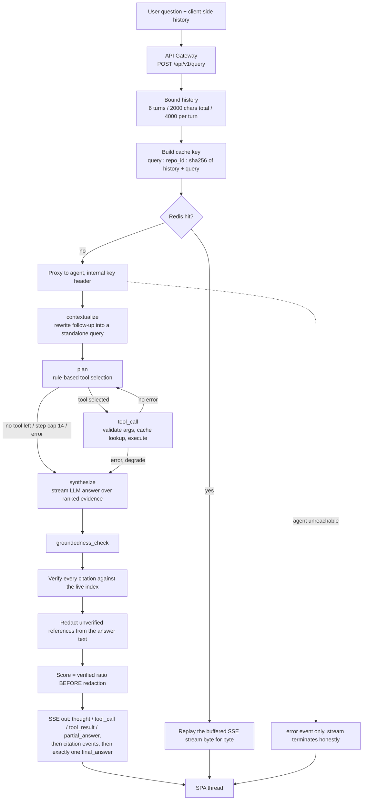
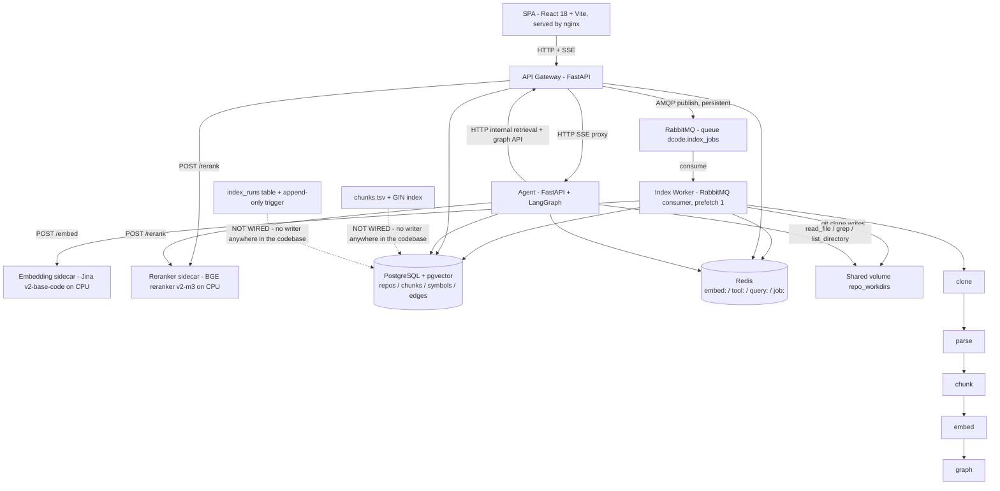

# Dcode — a code-understanding system that checks its own answers

## If you only read five sentences

1. This system is for developers who need to get up to speed on someone else's Python repository.
2. You give it a Git address, it splits the code into chunks and stores them, and then you can ask questions in plain language.
3. I built the whole path: the indexing pipeline, the retrieval, the agent that answers questions, and the frontend.
4. I also built an offline evaluation: the pass criteria were written down before any run, and I added a controlled experiment to separate which part actually helped.
5. The result was that my main hypothesis did not pass, and the feature I originally built the project around helped less than I expected.

---

## About this document

This is the third file under `docs/interview/`. It's written for the mentor who will edit my resume.

| File | Purpose |
|---|---|
| `DCODE_TECH_BRIEF.md` | Full technical brief. §4 is a ledger of quotable numbers, each tagged with a source level A/B/C/D and the sentence that has to be said alongside it. §4.9 lists numbers that must not be quoted. Appendix A has 25 documentation-drift entries |
| `DCODE_AGENT_ROLE_PREP.md` | Interview script, organised around what a hiring side looks for |
| **This file** | Resume material |

Every number in the body comes from the brief's §4 ledger. Where the ledger attaches a qualifier to a number, this file either carries that qualifier or uses a phrasing that doesn't need one. Numbers new to this file are in **Appendix A**, tagged the same way. Where the brief and the README disagree, the code wins.

### Project type: backend infrastructure plus an LLM application, led by the agent side

Both halves are really there. Neither is padding:

| Backend infrastructure | LLM / agent |
|---|---|
| A RabbitMQ consumer driving a strictly monotonic six-state indexing machine | A five-node LangGraph agent state machine |
| PostgreSQL + pgvector, four runtime tables, HNSW and reverse-edge indexes | 11 tools with Pydantic schemas for arguments, dispatched through a registry |
| Four Redis key spaces, each with its own TTL | The server issues citation IDs, and citations that fail verification get deleted |
| SSE gateway: trim history, compute a cache key, replay byte for byte on a hit | Five-tier offline baseline ladder, pre-registered criteria, plus a control arm |
| Idempotent submission, SSRF allowlist, internal service key, Alembic migrations | Hybrid retrieval: BM25 + pgvector + weighted RRF + cross-encoder rerank |

The agent side leads. The backend half exists so that every step the agent takes can be reproduced, cached and checked.

There is no training here, no loss, no RL, no fine-tuning. Every model is an off-the-shelf call. The static call-graph resolution is non-trivial, but it belongs to static program analysis, not machine learning. I keep that line visible throughout.

---

## Project description

Dcode helps a developer read an unfamiliar Python repository.

You submit a Git address. A worker clones the repository, splits it at function, method and class boundaries, computes embeddings, and extracts a symbol table plus call relationships. After that you ask a question, and an agent calls tools to gather evidence before writing an answer.

**Before the system emits any citation, it looks that citation up in the database.** A citation it cannot find gets deleted from the answer text and replaced with a placeholder. The groundedness score (what share of an answer's citations can be found in the index) is computed on the ratio **before** deletion, so deleting cannot raise the score.

The frontend follows the same rule. If a stream drops and no final answer ever arrives, the UI marks that turn as a fourth state. The draft is demoted and its citations are not clickable. "Never checked" and "checked and failed" are two different claims.

Around all of this I built an offline evaluation that can falsify me. It has a five-tier baseline ladder and pass criteria fixed before any run. A separate control experiment isolates where the gain came from.

---

## Architecture

Two diagrams. The first shows how one question travels through the system. The second shows which services exist and where data lives.

### 1. Agent control flow on the query path



### 2. Services and data layer



The second diagram has two dashed edges. `chunks.tsv` and its GIN index exist in the database, but no code anywhere in the repository writes to them (sparse retrieval runs on hand-written BM25 in the application layer). The `index_runs` table even has an append-only trigger, and it likewise has no writer. I drew them separately so nobody reads them as part of the main data flow.

---

## Where it sits in the AI stack

This section says what goes in, which models get called, and what comes out.

| Stage | Detail |
|---|---|
| **Input** | The offline indexing side takes a Git address. The online query side takes one plain-language question plus the prior turns the client sends along |
| **Models called** | `jinaai/jina-embeddings-v2-base-code` computes embeddings, running as a self-hosted HTTP sidecar on CPU. `BAAI/bge-reranker-v2-m3` does reranking, also a self-hosted sidecar. `gpt-4o-mini` writes the answer over OpenAI's streaming API. There is an abstract class for a judge, but **no model is wired behind it** |
| **Tools called** | 11 of them: semantic search, find definition, find references, call neighbours, call paths, forward and reverse module dependencies, file outline, read file, ripgrep, list directory |
| **Output** | One SSE stream: the reasoning trace first, then the streamed answer, then citation events carrying **only verified references**, then one final answer with a groundedness score. The frontend renders clickable citation chips and a source inspector from this |
| **Not produced** | No training, no fine-tuning, no model weights, no preference data |

Zoom out and this is evaluation and verification plumbing for agents. It does not produce a policy. It produces the ability to judge whether a policy is any good. Any team improving an agent with RL or preference optimisation has to answer two questions first. Where does the reward signal come from? How do you confirm the gain is real? This project is the engineering side of those two questions.

---

## Agent architecture

### a. Orchestration

The agent is a five-node LangGraph state machine, and a hand-written rule table picks the tools.

The nodes are defined at `apps/agent/src/dcode_agent/graph.py:774-778`:

```
START → contextualize → plan ⇄ tool_call → synthesize → groundedness_check → END
```

`plan → tool_call → plan` is the ReAct loop. Both `plan` and `tool_call` can branch conditionally into `synthesize` (`graph.py:782-791`). Requests are fully stateless. No LangGraph checkpointer is installed, and the client sends history on every call (`graph.py:770-771`).

**The planner is a hand-written rule table, not an LLM** (`graph.py:798-812`). That choice needs three layers to hold up.

**Layer one: why I chose it.** The central measurement in this project is a controlled experiment. Arm B3.5 is arm B4 with the call graph switched off and everything else unchanged. For that difference to mean anything, the two arms must differ only in their tool set. Answer generation is already stochastic enough on its own: across three identical runs, one level's margin swung by more than the pass threshold itself (see Interview positions, item 2). If the planner also ran on an LLM, the difference would additionally contain "which tool the model happened to pick this time", and the causal attribution would not hold. A rule table confines the gap between arms to one lookup table (`state.py:32-44`), and that table can be exhaustively unit-tested.

**Layer two: the cost is a real product defect.** Routing runs off keyword tables (`graph.py:1087-1112` and `:1312-1358`). An architecture question containing none of those keywords stops after the first retrieval. Worse, an outside observer cannot tell two cases apart: the planner deciding there is no next step, and the planner failing to understand the question. In the SSE stream they look identical.

**Layer three: what I would change to ship this.** Move the main path to LLM function calling. The JSON Schema for all 11 tools already exports through `ToolRegistry.manifest()` (`tools/base.py:58-67`), so the interface work is small. The rule table then retreats to two jobs: catch the case where the model's arguments fail validation, and hold a few safety limits. The step cap, the arm-level tool disabling, and the rule against repeating a call with identical arguments stay out of the model's hands.

After that switch, three things have to be added back before the controlled experiment works again. Configure the planner's temperature separately from synthesis. Run an A/A experiment that varies only the planner's seed, to size the planner's own variance. And record the tool-call sequence into the artifacts.

### b. LLM integration

The system calls one OpenAI endpoint to write answers, and forces the model to cite only IDs the server handed it.

| Item | Detail | Location |
|---|---|---|
| Provider | OpenAI Chat Completions, `openai` 2.49.0, with an overridable `base_url` for compatible endpoints | `apps/agent/src/dcode_agent/llm.py:129-154` |
| Model | `gpt-4o-mini` writes the answer. Set to `stub` and it falls back to a rule-based template | `llm.py:211-236` |
| Streaming | `stream=True`, and each delta becomes one `partial_answer` event | `llm.py:156-180`; `graph.py:266-274` |
| Citation protocol | Five mandatory rules in the system prompt. Cite only `[C#]` IDs from the server's catalog. Keep IDs outside backticks. Never substitute a filename, line number or symbol for an ID. Attach an ID to each concrete claim. Say so plainly when the evidence is not enough | `llm.py:43-53` |
| Call-graph rules | Three more. Resolved static edges and call expressions visible only in source must be described separately, and an unresolved target must never be called resolved | `llm.py:54-60` |
| Language | The answer's language follows the **original** question. Rewriting a follow-up does not change it | `llm.py:75-86`; `graph.py:269` |
| Follow-up rewriting | A separate call at `temperature=0` and `max_tokens=128` | `llm.py:182-208` |

### c. Tool layer

There are 11 tools. Every one declares its arguments as a Pydantic schema, and validation runs before execution.

The registry lives at `apps/agent/src/dcode_agent/tools/__init__.py:22-39`.

| Category | Tools | Exit |
|---|---|---|
| Retrieval | `search_code` | HTTP to the gateway's internal retrieval route |
| Symbols and graph | `find_definition` · `find_references` · `find_call_path` · `get_call_neighbors` · `get_dependencies` · `get_dependents` | HTTP to the gateway's internal graph routes |
| File structure | `get_file_outline` | HTTP |
| Local | `read_file` · `grep` · `list_directory` | Shared volume or a ripgrep subprocess |

**One abstraction.** Each tool is a `Tool[ArgsT, ResultT]` exposing five things: `name`, `description`, `ArgsSchema`, `execute` and `cache_key` (`tools/base.py:25-38`). Tools never connect to the database (`base.py:10-12`). They go over HTTP or to the local filesystem.

**Validation runs before execution.** `tool_call_node` calls `tool.ArgsSchema(**args)` first (`graph.py:113`). A validation failure degrades instead of reaching the user (`:114-117`). `read_file` adds a `model_validator` that rejects a start line below 1 or a start line past the end line (`tools/read_file.py:17-24`).

**Path traversal is blocked at two layers.** The first layer works on the string: absolute paths are rejected (`tools/common.py:55`), and so is any `..` that escapes the repository root (`:63`). The second layer runs after resolution and checks `is_relative_to(root)` (`:74-75`). Each of the three tools that touches the filesystem has its own traversal test (`test_tools_execute.py:216`, `:237`, `:261`).

**The cache-key format implies a constraint that is easy to miss.** A tool cache key is `tool:{tool}:{repo_id}:{sha256(canonical_json(args))[:16]}` (`packages/shared/src/dcode_shared/cache.py:19-21`). Since the key comes from the arguments, anything that changes a tool's behaviour has to live in the arguments. That is why `search_code` takes its retrieval mode as a tool argument instead of reading it from the environment. Put the mode in arm-level ambient state and two experimental arms that differ only in retrieval mode collide on one cache entry, which silently contaminates the evaluation. The reasoning sits at `tools/search_code.py:8-11`.

### d. Context and memory

Evidence gets its source code filled in first, then one model ranks all of it together.

**Fill in the source first.** Retrieval results arrive with source code attached. Graph results arrive as bare `file:line`. Send both into the prompt as they are, and the scoring model is no longer comparing relevance. It is comparing which side has something to read. That is measurement bias. So the code batches the graph results by `chunk_id` and fetches their source (`graph.py:498-529`, server side `GET /internal/get_chunks`), and only then does one cross-encoder (a model that reads the question and the code together as one text and scores the pair, more accurate than encoding them separately but slower) score every candidate (`graph.py:437-490`).

**Ranking features deliberately exclude evidence origin and graph distance** (`graph.py:451-454`). If you are testing whether the call graph helps, you cannot assume it helps inside the scoring function. A "prefer structural evidence" prior tuned on the evaluation set is a hyper-parameter picked to make the hypothesis pass. I take the cost: four of the six graph tools never produced a single cited piece of evidence across the whole evaluation.

**The context budget is ten items, identical for every arm** (`graph.py:432`). That number constrains the strongest arm. Graph evidence has to displace retrieval evidence to earn a slot. The weakest arm never has more than five retrieved chunks, so a bigger budget would do nothing for it. A bigger budget for the strongest arm would turn context length into a confound.

**Over-budget evidence loses its text but keeps its ID** (`graph.py:486-488`). It stays citable and verifiable, it just stops occupying context. That way a structural explanation never references an ID that does not exist.

**The retrieval stack** (`apps/api/src/dcode_api/routes/internal.py:241-299`):

```
sparse: hand-written Okapi BM25, k1=1.2, b=0.75
        the parameters are written into the run artifact, so this baseline reproduces
dense : pgvector HNSW cosine
        ↓ 50 candidates from each side
fuse  : weighted RRF, K=60, dense:sparse = 2:1
        ↓
rerank: cross-encoder over the top 16
        ↓
take  : keep 5, and filter test files after ranking (candidate pool and fusion math untouched)
```

Three terms, briefly. **BM25** is the classic keyword scoring algorithm, weighing term frequency against document length. **pgvector** is PostgreSQL's vector extension, which runs nearest-neighbour queries inside the database. **RRF** (Reciprocal Rank Fusion) merges two ranked lists by position rather than by score.

I fuse with RRF instead of normalising scores and adding them. BM25 scores are unbounded and depend on the corpus's IDF and length distribution, while cosine similarity is bounded and tightly clustered. Rank is the only quantity you can compare across those two rankers without assuming a distribution. The non-equal weighting has an empirical reason, and a test pins it from each direction (`test_internal_routes.py:444` and `:465`).

**The client sends multi-turn history, and the gateway trims it once**: at most 6 turns, 2000 characters total, 4000 per turn (`apps/api/src/dcode_api/settings.py:15-17`). Trimming happens in one place, so the planner, the body proxied to the agent, and the cache key all see the same turns. Only turns that received a final answer are fed back as context (`useThread.ts:43-55`), so a draft that never went through redaction can never re-enter as history.

**There is no server-side long-term memory**, and that is on purpose. With server-side session state the cache key would stop determining the output, and the evaluation would stop being reproducible.

### e. Reliability and control

The agent runs at most 14 steps, and a failed step counts. When a tool fails it still answers. When infrastructure fails it returns an error instead.

**Step cap 14, failures included** (`apps/agent/src/dcode_agent/settings.py:14`, incremented at `graph.py:168` and `:189`). I raised it from 8 after noticing that the strongest arm kept terminating at the budget rather than at the planner's decision. In that situation you are measuring your budget, not your policy. Counting failed steps is what makes the loop's upper bound real.

**Seven early-exit branches besides the cap**: the planner returns nothing, `state.error` is set (two places), the cap is reached (two places), no tool is pending, and an error on the tool-call edge. One of them is unreachable under the current graph topology, and the brief's drift list already flags it as defensive.

**Failures split into two layers, and the split lives in one function, `_record_tool_failure`** (`graph.py:175-209`):

| Layer | Behaviour | What the user sees |
|---|---|---|
| Tool: bad arguments, execution failure, cache decode failure | Degrade, go write the answer | Still gets an answer, with a note naming the tool that failed |
| Synthesis: LLM stream failure | Degrade, fall back to the rule-based template | Still gets an answer |
| Ranking: reranker failure, source-fetch failure | Degrade, fall back to observation order or leave that item blank | Nothing visible |
| Infrastructure: missing registry, database error during verification | Terminate, emit an `error` event | An explicit failure, and no answer |

**Retry counts differ per layer, each for its own reason:**

| Layer | Retries | Reason |
|---|---|---|
| Tool / internal HTTP | None | Tool failures are usually argument or index problems, and retrying does not fix those. Degrading to "answer from what we already have" is faster and more honest |
| Embedding | 12, exponential backoff capped at 30s. 4xx raises immediately | Indexing is offline and can wait. A model sidecar's cold start takes minutes |
| Reranker | 3, and `ReadTimeout` is deliberately left off the retry list | Querying is online and cannot wait. Retrying slow CPU inference just piles duplicate work onto a single-threaded model server |
| Gateway to agent | None, explicitly | A streaming response is not idempotent. A retry re-sends the half-answer already on the wire |

### f. Hallucination control and attribution

The model may only cite IDs the server gave it, citations it cannot verify get deleted, and the score is computed before deletion.

**First, the server issues the citation IDs.** The model may cite only the `[C#]` IDs sent for this request. An ID absent from the catalog fails outright (`groundedness.py:184-194`).

**Second, ordinary backticked code is not a citation** (`groundedness.py:150-151`). Writing `self.client.retrieve` is formatting, not an evidence claim. An earlier version treated every dotted inline token as a citation, and the model ended up "citing" something every time it named a method.

**Third, verify then delete, and score before deleting.** References that fail verification are removed from the text (`groundedness.py:407-426`), and only verified ones become citation events (`graph.py:727-738`). The score, though, uses the ratio **before** deletion (`groundedness.py:403`). This step carries the whole mechanism. Score after deletion and every answer is perfect, because deletion becomes laundering.

**Fourth, an answer with no citations scores 0 rather than full marks** (`groundedness.py:272`), and a separate count distinguishes "cited nothing" from "every citation failed". Without that, an agent that learns to say nothing scores full marks. I also rejected the option of dropping such answers from the denominator, since "don't cite where you're unsure" would raise the average the same way.

$$
g(a)=\begin{cases}\dfrac{1}{n}\displaystyle\sum_{i=1}^{n} v(r_i), & n > 0\\[2ex] 0, & n=0 \quad \text{(a convention, not a derivation)}\end{cases}
$$

**One detail is easy to miss and cannot be got wrong.** Symbol verification narrows candidates with SQL `LIKE '%.name'`. Underscores are everywhere in Python identifiers, and an underscore is a single-character wildcard in `LIKE`. Leave it unescaped and `api._get` also matches `api.aget`. That is a silent false positive inside a guard, and it is the one error this system cannot afford (`packages/shared/src/dcode_shared/symbols.py:56-64`). The same file records a related fix. Symbol resolution used to exist in two copies, one in the tools and one in the guard. Inside a single request the tool would say "here it is" while the guard said "that does not exist, strip it". There is one copy now.

### g. Evaluation and observability

Five baselines, pass criteria fixed before any run, and one control arm that separates where the gain came from.

Four agent arms share the same generation model, the same prompt, the same citation protocol and the same guard. Their only difference comes from one lookup table (`apps/agent/src/dcode_agent/state.py:32-44`). That is the precondition for the controlled experiment to mean anything.

| Arm | Retrieval | Answer path | In the criterion |
|---|---|---|---|
| B0 | External GitHub code search | Template | No (not reproducible) |
| B1 | Application-layer BM25 | Template | No (retrieval reference) |
| B2 | Dense only | Shared agent generation, same guard | Yes |
| B3 | Hybrid | Same, no tool expansion | Yes |
| **B3.5** | Hybrid | Same, keeps file reading and outlines, drops graph tools | **No (control arm)** |
| B4 | Hybrid | Same, all tools | Yes |

**The pass criterion is a pre-registered conjunction**: a 0.05 threshold, two reasoning levels times two rivals, and all four comparisons must clear (`apps/eval/src/dcode_eval/run.py:545-560`). Pre-registered means the criteria were written into the code and committed before the run, and could not be changed afterwards. I used a conjunction rather than an average, because averaging lets a big win at one level hide a failure at the other.

Scoring uses a composite, which is the mean of three retrieval metrics. Those three are recall (what share of the answers you should have found came back), MRR (how high the first correct result ranked), and nDCG (rewards correct results ranking higher, and unlike MRR it also counts the later hits).

**Arm B3.5 splits the system's gain into two parts.** An ablation means switching off one component, leaving everything else unchanged, and seeing how far the metric falls:

$$
\underbrace{B4 - B3}_{\text{the whole agent system}} = \underbrace{(B4 - B3.5)}_{\text{the call graph itself}} + \underbrace{(B3.5 - B3)}_{\text{multi-step evidence gathering}}
$$

**I put a constraint on myself here.** B3.5 is excluded from the criterion in code (`run.py:599-601`, `:605-616`, pinned by `apps/eval/tests/test_run.py:686`). Adding a new arm to the criterion would be changing the pass rules after the fact. So the most valuable finding in this project can only appear as a diagnostic. It cannot move the verdict.

**What is observable.** The SSE (Server-Sent Events, a one-way push from server to browser, well suited to streaming output) trace carries three event types: `thought`, `tool_call` and `tool_result`. The frontend expands them to show each call's arguments and a summary of its result. A groundedness pill shows a score only once a final answer arrives, and stays neutral while streaming. The indexing side emits structured per-stage logs and a live Redis snapshot. Skipped files and failure reasons both reach the frontend.

One thing has to be stated plainly: **the judge is not wired, so answer quality is completely unmeasured.** The `Judge` abstract class exists with its four-axis rubric and pairwise interface (`apps/eval/src/dcode_eval/metrics/judge.py:27-36`), but no real model sits behind it, and `pairwise_win_rate` is `null` throughout the artifacts. This evaluation can tell you whether the right code was found and whether a citation genuinely exists. It cannot tell you whether the explanation is correct or clear.

### h. Engineering

The SPA talks only to the gateway, and the four application packages import zero Python from each other.

**A single API seam.** The SPA never connects directly to the agent or the database. The agent, in turn, calls the gateway's internal retrieval routes over HTTP. The repository is 7 uv workspace packages (`pyproject.toml:8-16`), and the four application packages share no Python imports. They communicate over HTTP, AMQP, SQL and Redis only.

The evaluation harness is the cleanest case. It depends on `httpx` and the shared schema package and nothing else (`apps/eval/pyproject.toml:6-9`), so it cannot import the system it measures. It can only reach that system the way an external client would. That is what stops the evaluation from cheating through shared in-process state.

**Deployment and checks:**

| Item | Detail |
|---|---|
| Containers | `docker compose` brings up 6 long-running services plus 2 model sidecars behind opt-in profiles. Every service has a health check |
| Local checks | `make check` = lint + typecheck + test (`Makefile:80`). `make lint` runs one extra step that verifies evaluation-artifact consistency (`Makefile:70`). If a figure shown in the UI or the docs drifts from `results/`, lint fails |
| CI | `.github/workflows/ci.yml`, two jobs. The Python one runs ruff, mypy --strict, pytest and eval smoke. The frontend one runs eslint, tsc, vitest and build |
| Types | `mypy --strict` across all Python packages. TS strict on the frontend, plus a compile-time test that pins the hand-mirrored frontend/backend schema |

One distinction to state accurately: **the evaluation-artifact consistency check runs only in `make lint`, and CI does not run it.** The Python job in `ci.yml` has four steps: ruff, mypy, pytest, eval smoke.

---

## Backend infrastructure

This section covers the parts with no model in them: the indexing pipeline, the queue, the database, the caches.

### Indexing: a strictly monotonic six-state machine with dual writes

Six states are visible from outside: `queued → cloning → parsing → embedding → graphing → ready`, and `failed` is reachable from any of them (`packages/shared/src/dcode_shared/schemas.py:18-27`). The implementation is 4 `PipelineStage` entries driving 5 stage functions: `clone`, `parse`, `chunk`, `embed`, `graph` (`pipeline.py:51-56`). The `parsing` state runs two of those functions.

Monotonicity comes from the data structure. The stage order is an immutable tuple with no jump table and no conditional branches.

**Dual writes.** The Postgres `repos` row is the durable truth. The Redis `job:{repo_id}` key is the fine-grained snapshot the frontend polls, holding per-stage state, progress and a warning list. A failed Redis write is swallowed and never affects indexing.

**One piece of atomicity matters.** Deleting the old chunks and incrementing `index_revision` happen inside the same transaction (`stages/embed.py:173-179`), because the sparse-retrieval corpus cache is keyed on `(repo_id, index_revision)` and the two have to move together.

### Queue and idempotency

`POST /repos` persists and commits the row first, then publishes a persistent AMQP message (`apps/api/src/dcode_api/deps.py:44-58`). The order cannot be swapped, or the worker reads no row.

**A publish failure has a compensating path.** The row is already durable at that point, so it gets marked `failed` and the caller receives a 503. No permanently-queued zombie row is left behind.

On the worker side: `prefetch_count=1`, a durable queue, and acknowledgement only after the handler returns (`apps/worker/src/dcode_worker/main.py:19-30`). `handle_job` is guaranteed never to raise back to RabbitMQ, since a raise means the message gets redelivered forever.

**URL idempotency.** Six statuses count as reusable, and `failed` is deliberately excluded (`routes/repos.py:97-104`). A previous failure is exactly when a user wants a retry. URL normalisation stays narrow: trailing slash, `.git` suffix, and the case of the scheme and host. Path case is preserved (`:107-123`), because merging two genuinely different repositories is worse than keeping one duplicate row.

### Data model and indexes

Four runtime tables: `repos`, `chunks`, `symbols`, `edges` (`packages/shared/src/dcode_shared/db/models.py`). All are scoped by `repo_id`. Four native Postgres ENUMs map one-for-one onto Pydantic `StrEnum`s, pinned by tests.

Indexes live in the Alembic migration rather than the ORM, because pgvector's operator class has no portable expression through SQLAlchemy. They are: HNSW `vector_cosine_ops` on `chunks.embedding`, `(repo_id, file_path)`, a unique `(repo_id, qualified_name)` on symbols, and both forward and reverse edge indexes, `(repo_id, source_id, edge_type)` and `(repo_id, target_id, edge_type)`. The reverse one exists for "who references this" queries.

**The vector dimension is bound when the migration runs.** `Vector(embedding_dim)` appears in both the ORM and the migration, and the migration's copy freezes whatever the environment held at `alembic upgrade` time into the DDL. Changing the dimension therefore means rebuilding the database. That is an easy operational trap, and it is documented as one.

### Four Redis key spaces

| Key | TTL | Design point |
|---|---|---|
| `embed:{model}:{sha256(text)}` | None | Content-addressed. The same code appearing in two repositories gets embedded once |
| `tool:{tool}:{repo_id}:{args_hash}` | 24h | Includes an argument hash, so anything affecting tool behaviour has to live in the arguments |
| `query:{repo_id}:{sha256(history + query)}` | 1h | Includes conversation history. Without it, a context-dependent follow-up would collide with the same string asked single-turn |
| `job:{repo_id}` | 7 days after completion | No TTL while running, set only on completion |

Two details. `\x1f` (unit separator) delimits history from question, because that byte cannot appear inside the JSON, so the boundary is unambiguous. With empty history the digest is byte-identical to the old single-turn key, so adding multi-turn support did not orphan existing cached answers, and a test pins that.

### SSE gateway

The gateway forwards to the browser and buffers the whole stream at the same time. **It writes back to the cache only when the stream contains no `error` event** (`routes/query.py:72-73`). Caching a failed answer for an hour is worse than not caching. On a cache hit the whole stream replays byte for byte.

**When the agent is unreachable**, the gateway emits one `thought` event explicitly labelled `(skeleton)` followed by an `error` event (`:96-109`). The SSE protocol then terminates honestly instead of the connection just dropping.

### Security boundaries

- **SSRF allowlist.** Repository URLs must be http(s), ssh, git or scp-like. `localhost`, private addresses, loopback, link-local, multicast, reserved and unspecified IPs are all rejected (`routes/repos.py:187-224`).
- **Internal service key.** Every `/internal/*` route checks an `X-Dcode-Internal-Key` header (gateway `routes/internal.py:39-49`, agent `main.py:176-181`). The frontend never reaches that layer.
- **Path traversal.** See the tool layer.
- **Configuration hardening tests.** A test asserts that `.env.example` and the production compose file carry no known weak credentials and require secrets explicitly (`packages/shared/tests/test_config_hardening.py`).

---

## Interview positions

This section states the full conclusion, including the part that did not pass. It carries the same information as the resume bullets at a different density, and the reason for that split is in "Notes for my mentor", item 4.

**1. The main hypothesis came back `unsupported`.** The criterion was a pre-registered conjunction, and three of four comparisons cleared. Architecture-level questions cleared against both rivals (+0.247 and +0.169). Cross-file questions cleared against dense RAG (+0.136) and missed hybrid-plus-rerank by 0.0061. I do not retract or soften that. My own executable rule produced it.

**2. The cross-file result is not measurable at this scale.** Three identical runs produced +0.038, +0.006 and +0.088. The spread of 0.083 is wider than the 0.050 threshold itself. That 0.0061 shortfall sits against a between-repeat standard deviation of 0.034 (population figure; 0.042 as a sample statistic), so the shortfall is about a fifth of the noise. The fix is more questions or a second corpus, not more repeats. Resolving a difference this small at this suite size would take on the order of 100 runs. As a sanity check, the pure-retrieval baseline produced byte-identical metrics across all three repeats, which places the variance in answer generation and not in retrieval.

**3. The controlled experiment's result needs a per-level qualifier.** The call graph on its own contributes +0.0218 at cross-file level and +0.0226 at architecture level. Multi-step evidence gathering contributes +0.0221 at cross-file level and +0.1466 at architecture level. So "multi-step evidence gathering far exceeds the call graph" holds only at architecture level. At cross-file level the two are comparable, a ratio of 1.01. Both figures are diagnostics and both are excluded from the verdict in code.

**4. Two protocol changes ran in opposite directions.** Moving the scoring protocol from v1 to v2 put all four agent arms on one rule, and that change turned my own verdict from supported into unsupported. In the same batch I dropped groundedness from the composite. That genuinely lowered the bar. The removed term is 1.000 on every arm, so dropping it is arithmetically identical to moving the threshold from 0.050 to 0.0375. I do not dress that up.

Three defences are available, and all three are checkable. It was declared and committed before the run it judged. Both readings are published side by side in the artifact. Both readings return unsupported.

**5. The question set has a confound I only found later.** Taxonomy label and question provenance are collinear in this data. Every single-file question is hand-written, and every reverse-constructed question sits at the two higher levels with roughly twice the ground truth. So "leads at architecture level" and "leads on the reverse-constructed batch" cannot be separated. I measured which way it runs, and it does not favour me. The call graph's isolated contribution is +0.0183 on reverse-constructed questions against +0.0283 on hand-written ones. It is smaller on the reverse-constructed batch. That still does not rule the bias out. The bias takes the form of what is missing from the set, and the set's own metrics cannot detect that. It is now recorded in the run's limitations.

**6. The recorded run used an older call graph than the current code produces.** Re-running today's worker offline over the same corpus yields 316 call edges, against 303 in the database, a difference of 4.3%. The other three edge types match exactly, which places the difference in call resolution alone. The improvement is committed but needs a re-index to take effect, and re-indexing mid-comparison would move the corpus underneath the earlier runs.

**7. The judge is not wired, so answer quality is unmeasured.** See "Evaluation and observability".

**8. The static call graph's precision is quantified.** The resolver visits 2615 `ast.Call` sites and resolves 316 of them. The denominator is the call sites the worker actually walks, excluding module-level statements and methods of nested classes. That rate is reasonable for pure static AST analysis with no type inference. The largest unresolved group is 1076 `obj.X()` calls whose receiver type is unknown, and resolving those needs type inference, which this analysis explicitly declines. Missing an edge is safe; asserting a wrong one is not, so the design refuses to emit an edge it cannot ground. Unresolved calls are not discarded either. They are surfaced to the model explicitly, and a prompt rule forbids presenting them as resolved.

---

## Draft resume bullets

The impact clause uses two forms only: an A/B-level figure from the ledger with its qualifier, or a mechanistic result. There are no throughput, latency, cost or accuracy-lift figures, and the next section explains why.

1. **Designed and built** an end-to-end code-understanding system (FastAPI + LangGraph + PostgreSQL/pgvector + RabbitMQ + Redis + React 18) spanning 7 uv workspace packages, 6 long-running services, 2 model sidecars and 364 automated tests. The four application packages share zero Python imports and communicate only over HTTP, AMQP, SQL and Redis, so the evaluation harness cannot import the system it measures.

2. **Built** a citation-verification mechanism in which the server issues the evidence IDs and the model may cite only IDs sent for that request. **Any citation that fails index verification is removed from the answer text**, and the groundedness score uses the ratio before removal, **so removal cannot raise the score**. An answer citing nothing scores 0 rather than full marks, which closes the "say less, score more" exploit.

3. **Implemented** bounded agent orchestration: a 5-node LangGraph state machine and 11 tools with Pydantic argument schemas, path traversal blocked at two layers with a traversal test per filesystem tool. **A step cap of 14 in which failures also consume steps**, raised from 8 after the strongest experimental arm kept terminating at the budget rather than at the planner's decision. Seven early-exit branches, plus a layered failure policy where tool-layer failures degrade and infrastructure failures terminate, with retry counts differing per layer.

4. **Designed** a falsifiable offline evaluation: **a five-tier baseline ladder with a pre-registered conjunctive criterion** where all four comparisons must clear. A frozen 33-question suite with **62 ground-truth chunks**, **hand-labelled by level with no classifier in the code**. Three repeats totalling **495 agent invocations**, separating the stochasticity of generation. Plus a purpose-built **B3.5 control arm** splitting the gain into a call-graph term and a multi-step-evidence term. **That arm is excluded from the criterion in code**, so the rules cannot be changed afterwards.

5. **Built** a hybrid retrieval path: hand-implemented Okapi BM25 (parameters recorded in the run artifact, so the baseline reproduces) alongside pgvector HNSW cosine, fused by **weighted RRF**, reranked by a cross-encoder, then filtering test files after ranking, **cutting them in the candidate set from 47% to 0**. **Ranking excludes provenance and graph distance**, so scoring cannot presuppose the conclusion under test.

6. **Built** an asynchronous indexing pipeline: **a strictly monotonic six-state machine** in which 4 pipeline stages drive 5 stage functions. It dual-writes a durable Postgres row and a live Redis snapshot, and increments the corpus revision in the same transaction as the chunk replacement. `POST /repos` reuses an existing repository idempotently by URL while **deliberately not reusing failed rows**, which preserves retry semantics. `make lint` verifies evaluation-artifact consistency and **fails the build if any figure shown in the UI or docs drifts from the recorded run**.

7. **Traced and unified** the symbol-resolution rule behind citation verification: the guard matched exactly while the retrieval tools matched on suffix, so inside one request a tool reported a symbol found and the guard stripped it as nonexistent. After collapsing both onto one shared rule, a controlled three-arm nine-run comparison showed **verified citations rising from 48–54 to 62–67 and redaction markers falling from 17–21 to 9–13**, with symbol-form citations surviving for the first time, 0 to 2 per run.

### Seven is too many — pick by channel

I am not deleting any. You choose. The two channels look for different things.

**Technical applications, keep 4: 2 · 4 · 7 · 3.**

| Keep | Why |
|---|---|
| 2 citation verification | A technical interviewer wants to know how I make a model that invents things produce checkable output |
| 4 evaluation design | It shows I can set a standard I might fail |
| 7 symbol rule | The one complete "found a defect, here are the before and after counts" story, closest to daily work |
| 3 agent orchestration | Step caps, layered failure, retry policy — the basics for this role |

Drop 1 / 5 / 6. They describe standard backend and retrieval engineering, which is the most replaceable.

**HR screens and online applications, keep 3: 1 · 2 · 5.**

| Keep | Why |
|---|---|
| 1 system scale | A non-technical reader starts with size: how many packages, services, tests |
| 2 citation verification | A selling point that fits in one sentence and needs no background |
| 5 retrieval path | BM25, vectors and reranking are the role keywords both people and filters search for |

Drop 3 / 4 / 6 / 7. They ask the reader to follow an evaluation design or a debugging trail, which does not fit in thirty seconds.

---

## Data inventory: what each number proves

This section gathers every usable number in one place and says what each one means to a reader. There are three groups: the first can go straight onto a resume, the second needs a qualifying sentence, and the third stays verbal in an interview.

### Group 1 · Safe to put on a resume

These need no background. A reader takes in the magnitude at a glance.

| Number | What it is | What it proves | Source | Already in a bullet |
|---|---|---|---|---|
| **726** | Code chunks indexed from one repository | A real repository, not a toy sample | Brief §4.1 (A) | No |
| **724 / 37** | Symbols indexed / Python files indexed | Indexing produces a symbol table as well as chunks | Brief §4.1 (C+D / C) | No |
| **62** | Distinct ground-truth chunks behind the 33 questions | Correctness has an objective anchor, not my judgement | Brief §4.1 (A) | Yes |
| **364** | Automated test cases | Someone maintains this, not a one-off demo | Inventory tier C (C, 291+73) | Yes |
| **24,821** | Total lines of code | Large enough to be real, small enough to read | Inventory tier C (derived) | No |
| **257** | Git commits | Incremental work with a full history | Inventory tier C (C) | No |
| **495** | Agent invocations in one full evaluation round | An evaluation system, not a handful of examples | Inventory tier C (A, derived) | Yes |
| **33 = 5 / 16 / 12** | Questions across three difficulty levels | Questions are tiered, so a weak level shows up | Brief §4.4 (A+B) | Yes |
| **3** | Repeats of the same configuration | I know a single run can mislead | Brief §4.4 (A) | Yes |
| **5** | Tiers in the baseline (comparison arm) ladder | There is a reference frame, not self-comparison | Inventory tier C (B) | Yes |
| **5** | Retrieval cutoff k | Scoring looks at the top five only, and that is fixed | Brief §4.4 (A) | No |
| **7** | uv workspace packages | Boundaries are cut, not one large file | Brief §4.6 (B) | Yes |
| **6 + 2** | Long-running services + model sidecars | It needs orchestration, not a single script | Brief §4.6 (B) | Yes |
| **11** | Agent tools | The agent genuinely calls tools to check things | Brief §4.3 (B) | Yes |
| **5** | LangGraph nodes | The flow is explicit, drawable and testable | Inventory tier C (B) | Yes |
| **768** | Embedding vector dimension | A real embedding model, not a placeholder | Brief §4.2 (A) | No |
| **0** | Service errors observed across a full round | A full evaluation round ran without a failure | Brief §4.5 (A) | No |
| **47% → 0%** | Share of retrieved candidates from test files, before and after | I fixed a defect users could feel | Inventory, engineering chain 3 (B before / C after) | Yes |
| **48–54 → 62–67** | Verified citations, before and after unifying the symbol rule | After the fix, more evidence could be cited | Inventory, engineering chain 1 (A) | Yes |
| **17–21 → 9–13** | Redaction markers, same change | Users see fewer stripped-out references | Inventory, engineering chain 1 (A) | Yes |
| **0 → 2** | Surviving symbol citations per run, same change | A whole class of citation had been dying, and now survives | Inventory, engineering chain 1 (A) | Yes |

### Group 2 · Needs a qualifying sentence

Say any of these alone and the follow-up question lands immediately. The qualifier is what makes it safe.

| Number | The sentence that must go with it | What happens without it | Source |
|---|---|---|---|
| **473** | This is the sum of four edge types; call edges number 303 | Asked "how many are imports", I have nothing | Brief §4.1 |
| **303** | This is the value in the database; today's code re-indexed gives 316 | They pull the code, recompute, and the numbers disagree | Brief §4.1 |
| **2615 → 316, 12.1%** | The denominator is the call sites the worker actually walks | Bare "12%" reads as weakness; it is a declined capability | Brief §4.1 |
| **groundedness 1.000** (share of citations found in the index) | B1's 1.0 is a literal in the code; only the agent arms' is measured, and it needs "answers citing nothing: 0" beside it | Asked "how is that a perfect score", silence looks like gaming | Brief §4.5 |
| **candidate_recall 0.560** | All three hybrid arms are identical here; this measures the retrieval side | Quote it as B4's result and one comparison exposes that all three match | Brief §4.9 item 15 |
| **768 / 1024** | 768 is what runs; the code and compose both default to 1024 | They read `settings.py`, see 1024, and assume I misremembered | Brief §4.2 |
| **`unsupported`** | Three of four comparisons cleared | Stated alone it sounds like total failure | Brief §4.5 |
| **0.0061** | The between-repeat standard deviation is 0.034 | "Only 0.006 off" invites a variance question that exposes the 0.083 spread | Brief §4.5 |
| **+0.038 / +0.006 / +0.088** | The spread of 0.083 is wider than the 0.050 bar | Picking the third run and saying "it passed" is cherry-picking | Brief §4.5 |
| **+0.0218 / +0.0226 / +0.0221 / +0.1466** | All four are diagnostics, excluded from the verdict in code | Presented as the main result, they ask why it is not in the criterion | Brief §4.5 |
| **4/3** | Equivalent to moving the bar from 0.050 to 0.0375 | Omitting it hides a lowered bar, and the `run.py` comment says so anyway | Brief §4.5 |
| **12/12/12 and 14/12/16** | These come from the superseded origin set | Quoted as a result, the next question about the new set breaks it | Brief §4.5 |
| **0/0/0 and 4/3/5** | These are recomputed, not a committed artifact field | They search the artifacts and find neither number | Brief §4.5 |
| **440/248/152/111/36** | Four of the six graph tools never appear at all | The total alone suggests the graph tools earn their keep; four score zero | Brief §4.5 |
| **9/16 vs 10/17** | The two question types are nearly identical here | One ratio on its own leaves the reader without a comparator | Brief §4.5 |
| **BM25 k1=1.2 / b=0.75** (keyword scoring parameters) | BM25 is hand-written in the application layer; it does not use `tsv` or the GIN index | They conclude I used Postgres full-text search | Brief §4.2 |
| **291** | Collection only; I did not run them | "291 tests, all green" collapses when someone asks me to run them | Brief §4.6 |
| **73** | The 71 in `CLAUDE.md` is out of date | Two of my own documents disagree | Brief §4.6 |
| **10,952** | Excludes 16 `.py` files totalling 1743 lines under `node_modules` | They run `wc -l` themselves and get 12,695 | Brief §4.6 |
| **6 + 2** | `make up` does not start those two sidecars | In a live demo every query dies at embedding | Brief §4.6 |
| **4 + 1** | The `index_runs` table exists with no writer in the code | They open the migration and find the table empty | Brief §4.6 |
| **9/33 · q-009** | Under the v2 protocol, recall (share of what should be found that came back) is capped by how much the answer cites | They ask why recall is so low | Brief §4.5 |
| **B0's three file-level figures** | No arm in the recorded H1 run has file-level metrics | They ask "compared to what", and there is no comparator | Brief §4.7 |

### Group 3 · Verbal only, in an interview

| Item | Why it stays off the resume | How to say it |
|---|---|---|
| Scoring protocol v1 → v2, one rule for all four agent arms | Needs the whole evaluation story | "I changed the scoring protocol so all four arms used one rule. That change turned my own verdict from supported into unsupported." |
| Correcting the `GRAPH_TOOLS` set | Needs full context | "The counter credited the graph for a tool the no-graph arm still keeps. A measure that cannot tell a graph arm from a no-graph arm is not measuring the graph." |
| Adding the B3.5 control arm (ablation: switch off one component, hold everything else, see how far the metric falls) | It is a diagnostic and excluded from the verdict in code | "I added an arm I did not need. It demoted the headline feature of my own project, and I did not use it to move the verdict." |
| Dropping groundedness from the composite (the mean of three retrieval metrics) | It is not an improvement | "I removed a metric term, and that genuinely lowered the bar. Three defences are checkable, and both readings return unsupported." |
| Scoring an uncited answer 1.0 → 0.0 | It is not an improvement | "I changed a scoring convention, and two conclusions from my own earlier experiment stopped holding. The corrected numbers run against me." |
| Hydrating graph evidence: L3 call-graph contribution **−0.0067 → +0.0226** | It is a diagnostic and excluded from the verdict | "In one run the no-graph control arm actually beat the full arm on architecture questions. The cause was measurement bias: graph results carried only file and line, retrieval results carried source. After I filled in the source and ranked everything together, the same figure went from negative to positive." |
| Call resolution: call edges **303 → 316** | It is not an outcome | "I resolved two call shapes the analysis had missed. That adds a dozen edges, but I measured the downstream effect myself and it unlocks zero additional architecture-level ground-truth chains, and it needs a re-index to take effect." |
| RRF constant **K=60**, weights **dense:sparse = 2:1** | Configuration; a reader cannot judge whether 60 is good | "I fuse with RRF, which merges two ranked lists by position, instead of adding normalised scores. BM25 scores are unbounded and cosine is not. The weighting is unequal because at 1:1 the dense-only arm out-scored hybrid." |
| Candidate funnel **50 → 16 → 5** | Configuration | "Retrieval is a three-stage funnel: 50 candidates from each side, the top 16 reranked by a cross-encoder that reads question and code together, and 5 returned." |
| BM25 **k1=1.2 / b=0.75** | Configuration | "The parameters go into the run artifact, so that baseline reproduces. It is also why I did not use `ts_rank`, which is not BM25." |
| Step cap **14** | Configuration | "Raised from 8, because the strongest arm kept terminating at the budget rather than at the planner's decision." |
| Context budget **10** | Configuration | "Identical for every arm, which constrains the strongest one. Graph evidence has to displace retrieval evidence to earn a slot." |
| Base-class BFS depth **6** | Configuration | "It approximates the MRO without being the MRO. It ignores C3 linearisation, so a diamond can resolve to the wrong sibling." |
| Vector storage on **pgvector** with an HNSW cosine index | A technology choice, not an outcome | "Vectors and the call graph live in one Postgres, with pgvector (its vector extension) doing the nearest-neighbour query. That removes a separate vector store." |

### Two things I have to say first, before anyone asks

**About the 47% → 0% figure.** The commit message discloses a conflict of interest. I found this while investigating why L3 missed the bar by 0.0036, and no ground-truth file lives under `tests/`, so filtering test code also mechanically helps the metric. I have to say that sentence myself, in the interview. It changes character entirely if the other side reads it out of the commit first.

**About the three counts from unifying the symbol rule.** Those nine runs are single-baseline runs and carry no H1 verdict; `results/README.md` labels them "not a verdict". The experiment report states that the counts are the evidence and the means are the weak part. So I quote the three counts and never the groundedness means. On n=3 those mean ratios sit around p≈0.25 and p≈0.1, and the report says explicitly that it is not claiming statistical significance.

---

## Notes for my mentor

### 1. This project deliberately has no throughput, latency, token-cost or accuracy-lift numbers

Please do not suggest adding any. Anything I added would be invented, and not inventing is what this project is for. Point by point:

| Missing | Why |
|---|---|
| **Throughput / QPS / latency** | **No load testing was ever done.** Everything runs on one machine with CPU inference sidecars. The artifacts contain no timing fields and the code has no latency instrumentation. Any number would be made up |
| **Token cost** | **No cost accounting was ever done.** There is no token-counting logic anywhere in the code. The only budget dimension is step count |
| **Accuracy lift, "improved X%"** | The evaluation is offline, one repository, 33 questions, and the main hypothesis came back `unsupported`. Writing "improved by X%" would mean cherry-picking a favourable subset or quoting a diagnostic as a result. Both collapse at the second follow-up question |
| **Answer-quality metrics** | **The judge is not wired**, and `pairwise_win_rate` is `null` throughout. This evaluation can say whether a citation genuinely exists. It cannot say whether the answer is good |

### 2. Three kinds of evidence that stand in for quantified impact

| Type | Examples |
|---|---|
| **Mechanistic guarantees** | Citations that fail verification are removed from the answer. The score is computed before removal, so removal cannot launder it. Zero citations scores zero. An interrupted turn is a distinct state and its citations never bind |
| **Methodological strength** | Pass criteria were pre-registered. Five baselines, with four agent arms sharing one model, one prompt, one protocol and one guard. A self-built control arm does the causal split and is excluded from the criterion. Three repeats with variance analysis. A protocol change that ran against my own interest was published anyway |
| **Engineering scale** | 7 workspace packages, 6+2 containerised services, 4+1 tables, 11 tools, a 5-node state machine, 291 pytest cases, 73 vitest cases, 10,952 lines of Python plus 7,678 of tests, 4,746 lines of frontend plus 1,445 of tests. Test volume is close to a third of source, and most of it pins rules like citation verification rather than rendering |

### 3. Six phrasings that must not come back during editing

Each one collapses at the first or second follow-up in a technical interview:

| # | Do not write | What is true |
|---|---|---|
| 1 | "a call graph with 473 edges" | 473 is the **sum of four edge types** (calls / references / imports / inherits). **Call edges number 303** |
| 2 | Groundedness 1.0 presented as a result | The retrieval-only baseline's 1.0 is a **literal in the code**. Only the agent arms' figure is measured, and it only means something alongside "answers citing nothing: 0" |
| 3 | "multi-step evidence gathering is six times the call graph" | **Only at architecture level** (+0.1466 against +0.0226). **At cross-file level the two are comparable** (+0.0221 against +0.0218) |
| 4 | Recall described as retrieval capability | Under the v2 protocol the scored set is the verified citations in the answer. The three hybrid arms have **identical retrieval-side recall, 0.560** |
| 5 | "supports Postgres full-text search" | `chunks.tsv` and its GIN index exist but **have no writer anywhere in the codebase**. Sparse retrieval is **hand-written Okapi BM25 in the application layer** |
| 6 | "multi-language / cross-language code understanding" | The parser is the stdlib `ast` module and scans **`*.py` only** |

### 4. Why the H1 verdict reads differently in two places

The bullets sell a falsifiable evaluation design. The interview section states the full conclusion, including `unsupported` and the cross-file level being unmeasurable.

The two serve different purposes. A resume has thirty seconds to earn a conversation, so it is screening material. Interview positions have to survive three layers of follow-up, so they are load-bearing material. The information is the same and the density differs. The bullet says "I built an evaluation capable of falsifying my own hypothesis", which is true. The interview section adds "and it did falsify it", which is also true and works in my favour. Putting "my hypothesis failed" straight into a bullet moves load-bearing material into a screening slot, where it gets filtered before I can explain the methodology.

---

## ⚠️ For me to confirm or supply

| # | Open item | Note |
|---|---|---|
| 1 | **Team split and the boundary of my own work** | The git history contains PR merges, so this may not have been solo. The resume has to be clear about what I led and what I contributed to. **Not submittable until this is settled** |
| 2 | **Time span** | Start and end months. The first commit date is a reference point, not a measure of effort |
| 3 | **Public repository, and whether to link it** | If linking, note the repository holds `.env.example`, evaluation artifacts and internal documents. Worth a pass for anything not meant to be public |
| 4 | **Live URL** | Deployment today is local `docker compose`. Apart from a production compose overlay there is no sign of a hosted instance. With no live URL, the resume should not imply one |
| 5 | **Whether D-level figures belong on a resume** | Figures tagged **D** in the ledger (the 303 call edges, the recomputed 316, the second corpus's index size) depend on a running database and cannot be checked from the repository. My inclination: keep D-level figures out of the resume body, and allow them in interview with the source level stated |
| 6 | **Project name and one-liner** | Confirm the wording here matches whatever heads the resume and the LinkedIn entry |

---

## Appendix A: ledger for figures new to this document

Source levels follow the brief. **A** is a committed artifact field. **B** is a committed source constant. **C** is recomputed this pass. **D** depends on a running database or the local `.env`, and cannot be checked from the repository.

| Value | Meaning | Evidence | Level | **The sentence that must go with it** |
|---|---|---|---|---|
| **5** | LangGraph node count | `apps/agent/src/dcode_agent/graph.py:774-778` | **B** | "`plan ⇄ tool_call` is the ReAct loop, and both nodes can branch conditionally into `synthesize`" |
| **7** | Size of the closed SSE event set | `packages/shared/src/dcode_shared/events.py:13-21` | **B** | "It is a closed set pinned by a `Literal` type, and every payload is a Pydantic model" |
| **4** | Agent modes sharing one lookup table | `apps/agent/src/dcode_agent/state.py:32-44` | **B** | "The four agent arms share one model, one prompt, one protocol and one guard. The difference comes only from this table, which is what makes the controlled experiment valid" |
| **6 / 4 / 5** | Indexing: externally visible states, `PipelineStage` entries, stage functions | `packages/shared/src/dcode_shared/schemas.py:18-27`; `apps/worker/src/dcode_worker/pipeline.py:51-56` | **B** | "Six is the normal path `queued→cloning→parsing→embedding→graphing→ready`, with `failed` alongside. The `parsing` state runs both parse and chunk" |
| **2 jobs** | CI jobs and their steps | `.github/workflows/ci.yml:10,31` | **B** | "**CI does not run the evaluation-artifact consistency check.** That step exists only in `make lint` (`Makefile:70`)" |
| **180s** | git clone timeout | `apps/worker/src/dcode_worker/stages/clone.py:11` | **B** | "On timeout the subprocess is killed and the job moves to `failed`. The worker does not hang" |
| **1MB / 20k** | Per-file skip threshold, per-chunk content cap | `apps/worker/src/dcode_worker/settings.py:12-13` | **B** | "Both can be disabled by setting 0. Skipped files reach the frontend as warnings rather than being dropped silently" |

## Appendix B: phrasings carried over from the brief but rewritten here

| # | In the brief | Here | Why |
|---|---|---|---|
| 1 | "six-state machine" | "six externally visible states, 4 `PipelineStage` entries, 5 stage functions" | "Six states" is accurate for the enum, but a reader takes it to mean six stage functions. It is 4 entries driving 5 functions, since `parsing` runs two |
| 2 | "`make lint` verifies evaluation-artifact consistency" | Adds "CI does not run this step" | `ci.yml`'s Python job has four steps: ruff, mypy, pytest, eval smoke. No `sync_eval_artifacts.py --check`. Without the distinction a reader assumes CI enforces it |
| 3 | "multi-step evidence gathering is six times the call graph" | Always qualified to **architecture level**, immediately followed by "at cross-file level the two are comparable, a ratio of 1.01" | The claim holds at one level only. The bullets use no ratio at all, and the interview section gives all four figures across both levels |
| 4 | The call graph appears early as the project's selling point | Order is now citation verification first, then how the agent is kept in check, then the evaluation. The call graph appears under "Evaluation" and in interview position 8 | My own controlled experiment measured it down, so opening with it means opening on the weakest link |
| 5 | 473 and 303 sit as two separate ledger rows | 303 appears only in the interview section, flagged as the value in the database. The bullets use no edge count | Any edge count needs a qualifier however it is written, which does not fit a bullet that has thirty seconds to land |
| 6 | Arms referred to as `B1/B2/B3/B3.5/B4` throughout | Mentor-facing passages say "retrieval-only baseline / dense RAG / hybrid / no-graph control arm / full system" | A mentor has not read the brief, and the codes get in the way. Technical sections keep them for cross-referencing |
| 7 | Groundedness 1.000 described as measured | Stated explicitly: the retrieval-only baseline's 1.0 is a literal, only the agent arms' is measured, and it needs `answers_without_citations = 0` alongside it to mean anything | This is one of the six forbidden phrasings, so the resume material has to nail it down before an editing pass turns it back into a result |
